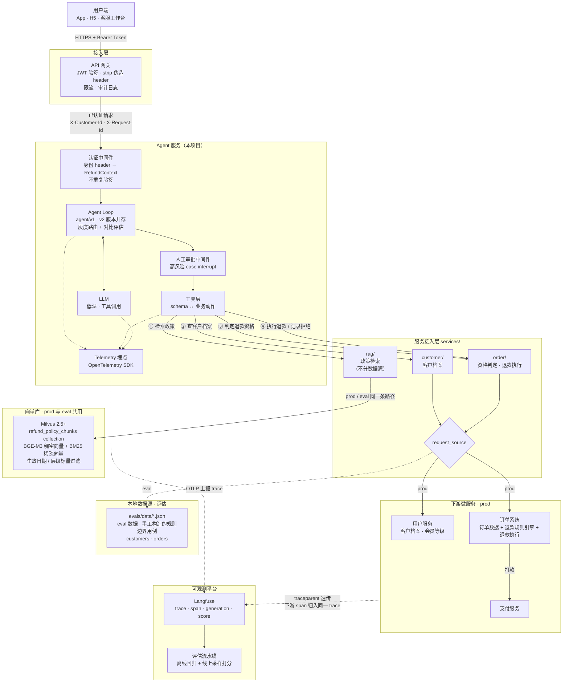
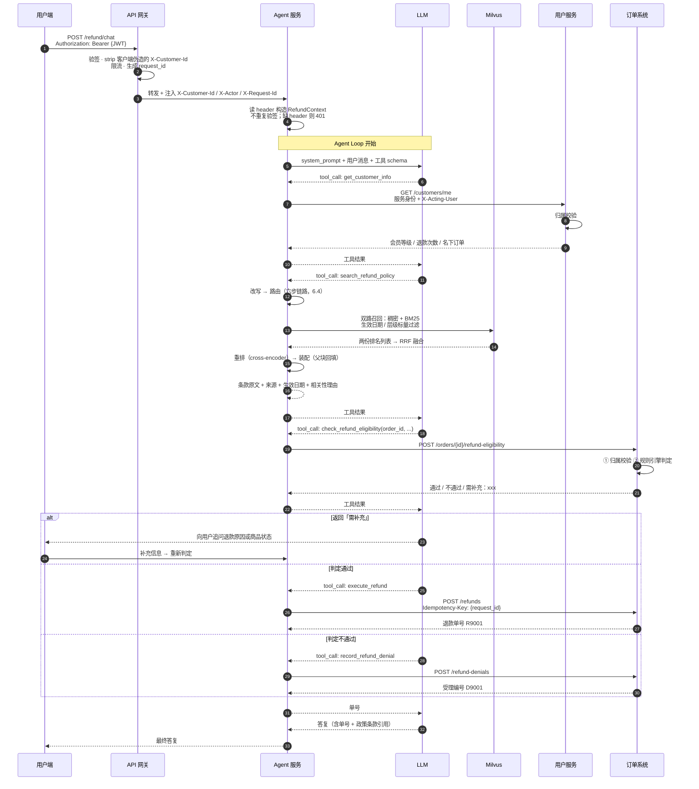
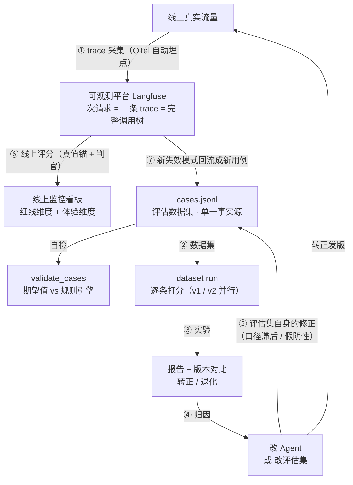

# RefundAgent —— 电商退款处理 Agent

面向生产环境的退款客服 Agent 设计文档。核心命题是：**把「理解用户」交给模型，把「判定与执行」交给确定性系统**，让每一笔退款决策可复现、可审计、可回溯。

---

## 一、业务场景

### 1.1 要解决什么

用户在 App / H5 / 客服工作台发起退款申请，通常表述模糊（"这个东西不太合适想退掉"、"收到就是坏的"）。传统方案是规则表单 + 人工客服：表单填不对就转人工，人工成本高、时效慢。

RefundAgent 承接这一层：**理解用户的自然语言诉求 → 检索适用政策 → 调用规则引擎判定 → 执行退款或给出可解释的拒绝理由**。目标是让 70%+ 的标准申请自动闭环，剩余的高风险 / 边界 case 带着完整上下文转人工。

### 1.2 处理 SOP（写死在系统提示里，不给模型自由裁量）

| 步骤 | 动作 | 说明 |
|---|---|---|
| 1 | 提取订单号 | 客户身份**不从对话提取**，来自网关认证结果 |
| 2 | 查询客户档案 | 会员等级、近 90 天退款次数 |
| 3 | 检索退款政策 | RAG 检索适用条款，供答复引用 |
| 4 | 判定退款资格 | 调用订单系统的规则引擎，**其结论是唯一依据** |
| 5 | 执行终局动作 | 批准打款 / 拒绝落库，必须拿到单号后才能答复用户 |

模型的自由度只在**第 1 步的意图理解**和**第 5 步的解释措辞**。流程走不走、判定通不通过，都不由模型决定。

### 1.3 判定规则（由订单系统的规则引擎实现）

| 规则 | 内容 | 优先级 |
|---|---|---|
| 订单有效性 | 订单存在、未退款、归属当前客户 | 最高 |
| 风控 | 近 90 天退款 > 3 次 → 关闭自动通道，转人工 | 高于会员权益 |
| 类目黑名单 | 生鲜 / 定制 / 虚拟商品 一律不退 | — |
| 退货窗口 | 无理由：普通 7 天、金牌 15 天；质量问题：一律 15 天 | — |
| 商品条件 | 无理由需未拆封；质量问题不受此限 | — |

---

## 二、整体架构



### 组件职责

| 组件 | 职责 | 明确**不**负责 |
|---|---|---|
| API 网关 | JWT 验签、**strip 客户端伪造的身份 header**、注入身份 header、限流、生成 request_id | 业务逻辑、授权判定 |
| 认证中间件 | 读网关注入的身份 header → 类型化 `RefundContext`；**不重复验签**，缺 header 直接 401 | 验签、授权判定 |
| Agent Loop | 编排工具调用、管理对话状态 | 业务规则 |
| 工具层 | schema ↔ 业务动作的双向翻译 | 业务规则、授权判定、协议细节 |
| **服务接入层** | 下游能力的统一入口；客户档案与订单按 `request_source` 选择 prod / eval 实现，政策检索不分数据源 | 业务规则 |
| Milvus 向量库 | 政策条款混合检索（稠密 + BM25）+ 生效日期过滤；**prod 与 eval 共用同一 collection** | — |
| 用户服务 | 客户档案（**自己做归属校验**） | — |
| 订单系统 | 订单数据 + **退款规则引擎** + 退款执行（**自己做归属校验**） | — |

**关键分工：规则引擎放在订单系统，不放在 Agent 服务。** 理由有三：数据在那边（窗口计算要用签收时间）、授权判定必须在数据所有者一侧、规则变更由订单团队独立发版而不必动 Agent。

---

## 三、请求链路



**「说了」与「做了」的绑定机制**：单号只有真正调用了执行工具才拿得到，而答复里必须写明单号。这样模型无法"只在文字里宣布结果却没落库"——这是 agent 类系统最典型的一类事故。

---

## 四、身份与授权

### 4.1 三类标识，传法不同

| 类型 | 例子 | 来源 | 传递方式 | 模型可见 |
|---|---|---|---|---|
| 主体身份 | `customer_id` | 网关注入（源自 JWT claims） | Context 注入 | ❌ 不可见不可改 |
| 操作者 | `actor`（自助 / 客服代操作） | 网关注入（源自 JWT claims） | Context 注入 | ❌ |
| 资源引用 | `order_id` | 对话文本 | 工具参数 | ✅ 但服务端必须校验归属 |

**核心原则：身份来自认证，不来自对话内容。** 把 `customer_id` 放进工具 schema，等于把"访问谁的数据"的决策权交给一个可被 prompt injection 操控的组件——这是 IDOR 越权漏洞。

### 4.2 信任边界：网关与 Agent 的分工

网关做完 JWT **验签**之后，Agent 服务**不再重复解析 JWT**，但它仍然需要 claims 里承载的**身份数据**——只是来源从"自己解析 token"变成"读网关注入的 header"。

| 职责 | 网关 | Agent 服务 |
|---|---|---|
| JWT 验签、过期校验、吊销检查 | ✅ | ❌ 不重复做 |
| 从 claims 提取 `sub` / `act` / `tenant` | ✅ | ❌ |
| **剥离客户端伪造的同名 header** | ✅ **必做** | — |
| 读取身份 header → `RefundContext` | — | ✅ |
| 授权判定（能不能操作这个订单） | ❌ | ❌ 由下游服务做 |

> ⚠️ **最容易踩的坑：网关必须 strip 掉客户端传入的 `X-Customer-Id` 等同名 header。**
> 否则攻击者直接在请求里带一个 `X-Customer-Id: C9999`，网关原样透传，Agent 信以为真——认证形同虚设。这是网关注入模式的头号事故来源，必须在网关配置里显式声明「先清除、再注入」。

配套的前提是**网络隔离**：Agent 服务不能直接暴露在公网，只接受来自网关的流量（VPC 内网 / mTLS / 服务网格授权策略）。否则绕过网关直连 Agent，同样能伪造 header。

三种方案的取舍：

| 方案 | Agent 侧做什么 | 防绕过强度 | 适用 |
|---|---|---|---|
| **A. 网关注入明文 header** | 读 header，零加密开销 | 依赖网络隔离 + header strip | ✅ **本项目选型**，内网可信 |
| B. 网关透传原始 JWT | 仍需验签（重复劳动） | 强 | 网关只做路由时 |
| C. 网关换发内部短时 token | 验内部 token（audience=内部服务） | 最强，绕过也无效 | 零信任 / 金融级合规 |

选 A 是因为内网可控且省一次验签开销；**若后续接入外部渠道或合规要求提升，切换到 C，改动只在认证中间件一处**。

### 4.3 Context 定义与注入

```python
from dataclasses import dataclass
from fastapi import Header, HTTPException
from langchain.agents import create_agent

@dataclass
class RefundContext:
    customer_id: str            # 主体身份，由网关从 JWT claims.sub 提取后注入
    actor: str = "self"         # self | staff:{staff_id}，审计要用
    request_id: str = ""        # 贯穿全链路的追踪 ID，兼作幂等键
    request_source: str = "prod"  # prod | eval，评估时切换数据源

agent = create_agent(
    model=init_chat_model("anthropic:claude-sonnet-5", temperature=0),
    tools=[search_refund_policy, get_customer_info,
           check_refund_eligibility, execute_refund, record_refund_denial],
    system_prompt=SYSTEM_PROMPT,
    context_schema=RefundContext,
)

# 认证中间件：只读网关注入的 header，不解析 JWT
def build_context(
    x_customer_id: str = Header(None),
    x_actor: str = Header("self"),
    x_request_id: str = Header(None),
) -> RefundContext:
    # 取不到就是没经过网关 —— 直接拒绝，绝不 fallback 成匿名或默认值
    if not x_customer_id or not x_request_id:
        raise HTTPException(401, "missing gateway identity headers")
    return RefundContext(
        customer_id=x_customer_id,
        actor=x_actor,
        request_id=x_request_id,
    )

# HTTP handler
result = await agent.ainvoke(
    {"messages": [{"role": "user", "content": req.text}]},
    context=build_context(...),
)
```

**取不到 header 必须 401，不能降级。** 静默 fallback 成空值或默认租户，等于给绕过网关的请求开了后门——这类 bug 在测试环境（没配网关）最容易被引入，然后一路带到生产。

### 4.4 工具侧接住身份

`runtime` 参数**不会出现在发给模型的 tool schema 里**：

```python
from langchain.tools import ToolRuntime

@tool
def get_customer_info(runtime: ToolRuntime[RefundContext]) -> str:
    """查询当前客户的档案：会员等级、近 90 天退款次数、名下订单。"""
    ctx = runtime.context
    return user_client.get_profile(
        customer_id=ctx.customer_id,     # 模型无从干预
        request_id=ctx.request_id,
    )
```

### 4.5 到下游微服务这一跳

**不要把用户 JWT 原样透传给下游**（audience 不对、有效期不受控、下游被攻破即泄露用户凭证）。用**服务身份 + 显式 acting-on-behalf-of**：

```
Authorization: Bearer <agent 服务自己的 service token>
X-Acting-User:  C1001          ← 代表谁在操作
X-Request-Id:   req-abc-123
```

下游服务用自己的逻辑做权限判定。**Agent 只负责如实转述身份，不负责授予权限。** 合规要求高的场景改用 OAuth token exchange（RFC 8693）换取 audience 为下游的短时 token。

### 4.6 归属校验必须在下游

```python
# 订单系统侧
def check_eligibility(order_id, acting_user):
    order = db.orders.get(order_id)
    # 不存在 与 不属于你 返回同一句话 —— 区分开会泄露订单号是否存在
    if not order or order.customer_id != acting_user:
        return Result(passed=False, reason=f"订单 {order_id} 不存在")
```

即便 Agent 被完全操控，它的 service token 里携带的 `X-Acting-User` 也只能是当前登录用户——**越权在数据所有者那一侧被挡住**。

---

## 五、工具设计

| 工具 | 下游 | 模型可填参数 | Context 注入 | 副作用 |
|---|---|---|---|---|
| `search_refund_policy` | Milvus | `query` | — | 无 |
| `get_customer_info` | 用户服务 | **无** | `customer_id` | 无 |
| `check_refund_eligibility` | 订单系统 | `order_id`, `reason_type`, `item_condition` | `customer_id` | 无 |
| `execute_refund` | 订单系统 | `order_id`, `amount`, `reason` | `customer_id`, `request_id` | **打款** |
| `record_refund_denial` | 订单系统 | `order_id`, `reason` | `customer_id`, `request_id` | 落库 |

### 设计约束

**参数取值必须由代码校验，不能只写在 docstring 里。** docstring 对模型是建议，只有代码校验才是约束：

```python
REASON_TYPES = ("无理由", "质量问题")

if reason_type and reason_type not in REASON_TYPES:
    return (f"参数错误：reason_type 只能是「无理由」或「质量问题」，"
            f"收到「{reason_type}」。请按用户实际诉求重新判断后再次调用。")
```

返回**可纠正的错误提示**而不是抛异常——模型看到提示能自行改正重试，比整轮失败好。

**「需补充」由规则引擎决定，不由模型自由裁量。** 订单系统先跑完所有与 `reason_type` / `item_condition` 无关的硬否决（不存在、已退款、类目黑名单、高风险、超出最宽窗口）；只有全部通过、判定确实取决于缺失参数时，才返回 `需补充：...`。这样避免模型在"横竖都不通过"的 case 上还去追问用户，白白拖长处理时间。

---

## 六、服务接入层与数据源切换

### 6.1 为什么工具层不直接调下游

工具层与下游微服务之间隔一层 `services/`，理由有三：

1. **评估可切换数据源**——离线评估必须能在不连任何**业务**服务的前提下跑完（核心动机）。政策检索是唯一的例外：它不切数据源，prod 与 eval 都连 Milvus，理由见 6.4
2. **协议变更不扩散**——订单系统从 REST 改 gRPC，只动 `services/order/prod.py` 一个文件
3. **横切关注点收敛**——服务身份 token、`X-Acting-User`、`traceparent`、重试、熔断、超时，统一在 `services/base.py` 处理，工具层不用重复写

### 6.2 一个服务 = 一个接口 + 按需的实现

```python
# services/customer/protocol.py —— 接口定义，工具层只依赖它
from typing import Protocol

class CustomerService(Protocol):
    def get_profile(self, customer_id: str) -> CustomerProfile: ...

# services/factory.py —— 按 request_source 选实现
def customer_service(ctx: RefundContext) -> CustomerService:
    match ctx.request_source:
        case "prod":    return ProdCustomerService(ctx)      # HTTP → 用户服务
        case "eval": return EvalCustomerService(ctx)   # 读 data/customers.json
        case other:     raise ValueError(f"unknown request_source: {other}")
```

工具层拿到的永远是 `CustomerService` 这个接口，**不知道也不关心**数据从哪来：

```python
@tool
def get_customer_info(runtime: ToolRuntime[RefundContext]) -> str:
    ctx = runtime.context
    profile = customer_service(ctx).get_profile(ctx.customer_id)
    return render_profile(profile)      # 渲染成 LLM 好读的文本
```

**未知的 `request_source` 必须抛异常，不能 fallback 到 prod。** 拼错一个字母就静默连上线上库，是这类工厂函数最典型的事故。

**「两个实现」是常态，不是规定。** 客户档案和订单各有 prod / eval 两个实现；政策检索只有一个 —— `rag_service()` 不看 `request_source`，直接返回 Milvus 实现（6.4）。抽象的价值在于**调用方不必知道有几个实现**：工具层拿到的永远是 `RagService` 接口，将来真要给它加一个数据源，改动仍然只在工厂函数里。

### 6.3 eval 数据格式

手工构造，**每条对应一个规则分支**，`_note` 字段写明它守的是哪条边界：

```jsonc
// evals/data/orders.json
{
  "O2011": {
    "customer_id": "C1006",
    "product": "羊绒大衣",
    "category": "服饰",
    "price": 1580.00,
    "signed_days_ago": 15,          // 相对天数，不是绝对时间戳
    "refunded": false,
    "_note": "金牌窗口边界内：15 == 15，判定条件是 > window，应通过"
  },
  "O2012": {
    "customer_id": "C1006",
    "signed_days_ago": 16,
    "_note": "金牌窗口边界外：16 > 15，超出一天也应拒绝"
  }
}
```

> ⚠️ **时间必须相对化。** 用 `signed_days_ago` 而非 `signed_at` 绝对时间戳——否则数据集放三个月后，所有窗口判定全部失效，而且失效得悄无声息（用例还在跑，只是答案全错了）。

**eval 数据查不到必须显式失败。** Agent 是非确定性的——改了 prompt 之后它可能用一个 eval 数据里没有的入参去查。这时候绝不能静默返回空值当作"查无此人"，否则用例会以一个**看似合理的错误结论**通过。正确做法是抛 `EvalDataMissError`，把这条用例标记为 `invalid` 而非 `failed`——它不是回归，是 eval 数据覆盖不足。

> 📌 **录制回放（replay）暂不支持。** 当 eval 数据的手工维护成本变高、或需要真实数据形态（脏数据、字段缺失、异常枚举）时再引入：从线上 trace 录制下游响应、脱敏后按 `(service, method, args)` 固化查表。届时只需在 `factory.py` 增加一个 `case "replay"` 分支，`services/` 的接口和工具层都不用动——这正是这一层抽象的价值。

### 6.4 RAG 为什么不切数据源

政策检索**不做 eval 实现**：`prod` 与 `eval` 都直连 Milvus，同一个 collection、同一条代码路径。这与客户档案、订单的处理方式相反，理由是**检索结果本身就是被评估的对象**：

- 答复里要引用条款原文。「模型判断得对不对」和「检索给没给对条款」在真实的失败里常常是同一个问题——线上被投诉的答复，很大一部分错在引了一条不适用的政策，而不是错在规则判定。为离线评估另造一份写死的条款，等于把这段逻辑整体排除在回归之外。
- 两份条款必然漂移。写死那份改了、Milvus 那份没改（或反之），评估全绿而线上照错——而且错得悄无声息，因为回归报告看起来一切正常。

代价要认：RAG 确实是评估里的**不确定性来源**，这些变化都与 Agent 的改动无关，却会污染回归结论。不做隔离，就得逐条按住：

| 变化 | 后果 | 按住它的办法 |
|---|---|---|
| 政策改版、重新灌库 | 同一条用例昨天过今天挂 | collection **按版本发布**（`refund_policy_chunks_v3`），评估固定指向某个版本；线上灰度切换，**不在原 collection 上原地 drop 重建**——重建的空窗期里检索返回空，Agent 会直接失败 |
| embedding 模型升版本 | 向量空间整体偏移，TopK 排序全变 | 灌库与检索共用同一个 `llm.embedding.embedder()`；模型版本随 `agent_version` 一起记进 trace，换模型视同一次发版，要重跑基线 |
| 切分参数（块大小 / 父块粒度）调整 | 召回单元变了，命中的条款跟着变 | 参数集中在 `knowledge/chunking/policy.py`，与 collection 版本绑定发布；调参必须重跑检索基线（见下） |
| 索引参数（nlist / ef）调整 | 召回集合抖动 | 几百个块，稠密一路直接用 `FLAT` 精确检索——没有可抖的参数 |
| 查询改写的 LLM 抖动 | 同一 query 拆出的子查询不同，召回跟着变 | 改写模型固定版本、温度 0，改写结果记进 trace；`REFUND_AGENT_REWRITE=off` 可整体关掉换取确定性（代价见 `pipeline/rewrite.py`） |
| collection 空 / 灌库没跑 | 拿不到条款 | 检索返回空时**显式抛错**，不让 Agent 带着一句「未检索到条款」继续判定——那等于把它推回「凭记忆编政策」 |

配套的两件事：

- **回归报告波动时的排查顺序**：先看 trace 里 `tool.search_refund_policy` 这一 span 返回的条款变没变，再怀疑 Agent。顺序反了，就会把知识库的一次灌库归因成「prompt 改坏了」——这正是 9.1 里 ⑤ 那条反向箭头要防的事。检索内部还要再分一层——六步链路每一步的中间产物都在 trace 里（`REFUND_AGENT_RAG_TRACE=on`），「明明有条款却没召回」和「召回了但没排上来」是两种病，修法完全不同。
- **检索质量仍然单独评估**：另建一套 retrieval 数据集（query → 应召回的 section），指标用 recall@k / MRR。它回答的是「检索器好不好」，与「Agent 这次改动有没有变差」是两个问题，不能互相顶替。

> ⚠️ 直接的代价：**离线评估不再是零外部依赖**。CI 里要先拉起一个 standalone Milvus 并跑灌库脚本（`knowledge/seed_milvus.py`），评估才能跑。这是上面那些好处的价格，接受与否取决于团队 CI 环境的成本。

---

## 七、幂等与终局动作

退款是资金操作，**必须幂等**。

- 幂等键用 `request_id`（网关生成，贯穿全链路），随 `Idempotency-Key` header 发给订单系统
- 订单系统对同一幂等键返回**同一个退款单号**，而非重复打款
- Agent 侧重试（超时、5xx）安全：重试携带相同幂等键

**高风险 case 走人工审批**：金额超阈值、风控命中、判定为边界值时，用 LangGraph 的 `interrupt` 挂起，等人工确认后恢复。审批状态由 checkpointer 持久化，服务重启不丢。

**审计流水字段**：`decision`、`refund_no`、`order_id`、`amount`、`reason`、`actor`、`request_id`、`trace_id`、`policy_refs`。缺 `actor` 和 `request_id` 的流水事后追不到人、对不上链路。

---

## 八、可观测性：Telemetry → Langfuse

Agent 服务通过 OpenTelemetry SDK 埋点，以 OTLP 协议把 trace 上报到 **Langfuse**——它既是排障用的观测平台，也是评估体系的数据源（线上采样的用例、人工标注的 badcase 都从这里回流）。

### 8.1 一次请求 = 一条 trace

```
trace: refund-chat  [request_id=req-abc-123, user=C1001, session=sess-77]
├── span  auth.middleware                          2ms
├── span  agent.loop                             4.3s
│   ├── generation  llm.call#1                    980ms   in 1.2k / out 64 tok
│   ├── span  tool.get_customer_info              120ms
│   │   └── span  http.user_svc GET /customers/me  95ms
│   ├── generation  llm.call#2                    760ms
│   ├── span  tool.search_refund_policy           940ms
│   │   ├── generation  rag.rewrite (haiku)       280ms   → 2 条子查询, needs_law=false
│   │   ├── span  rag.recall  dense+bm25 ×2 层    190ms   → 20 候选 (单路命中 4)
│   │   ├── span  rag.rerank  cross-encoder       380ms   → 17 条过阈值
│   │   └── span  rag.assemble 父块回填            90ms   → 4 块 / 1.2k tok
│   ├── generation  llm.call#3                    890ms
│   ├── span  tool.check_refund_eligibility       150ms
│   │   └── span  http.order_svc POST /eligibility 130ms   → "不通过：超出窗口"
│   ├── generation  llm.call#4                    620ms
│   └── span  tool.record_refund_denial            98ms    → D9001
└── span  response.render                           5ms

scores (异步写回): rule_consistency=1.0  tool_sequence=1.0  citation=0.8  latency_p95=pass
```

**trace 层级要和业务语义对齐**，不要平铺。`tool.*` span 套着 `http.*` span，排障时一眼能分清是「模型选错了工具」还是「下游服务慢/报错」——这两类问题的处理人完全不同。

### 8.2 埋点要素

| 层级 | 必记字段 |
|---|---|
| trace | `request_id`、`customer_id`（脱敏后的稳定哈希）、`session_id`、`agent_version`、`prompt_version` |
| generation | 模型名、温度、input/output token、耗时、finish_reason |
| tool span | 工具名、入参、返回、耗时、是否报错、重试次数 |
| http span | 下游服务名、路由、状态码、`traceparent` |

`prompt_version` 和 `agent_version` 是评估归因的关键：线上指标掉了，要能立刻回答「是哪次发版引起的」。

### 8.3 跨服务传播

**trace context 必须透传到所有下游**（W3C `traceparent` header），否则 trace 会断成几截——Agent 服务看到一次 130ms 的 HTTP 调用，但订单系统内部规则引擎为什么慢、查了几次库，全都看不到。

`clients/base.py` 统一处理三件事，业务代码不用管：注入服务身份 token、注入 `X-Acting-User`、注入 `traceparent`。

```python
class DownstreamClient:
    def _headers(self, ctx: RefundContext) -> dict:
        headers = {
            "Authorization": f"Bearer {self._service_token()}",
            "X-Acting-User": ctx.customer_id,
            "X-Request-Id": ctx.request_id,
        }
        inject(headers)          # opentelemetry.propagate.inject → traceparent
        return headers
```

### 8.4 脱敏

上报前统一过一层脱敏：手机号、收货地址、支付账户、真实姓名。**这一层不能只加在 Langfuse 上报路径上**——线上评估的 LLM judge 也读同一批 trace，PII 会随之进入 judge 的 prompt。脱敏做在 span 属性写入处，一处生效。

### 8.5 Trace 归档

每轮实验的原始 trace 单独归档一份（按 `run_name` 分目录），便于事后重查。Langfuse 上的数据会随保留策略过期，而"三个月前那次改动到底为什么退化"是常见诉求——完整闭环见第九章。

---

## 九、持续评估闭环

Agent 不能靠人肉验收：输出是自然语言、路径是非确定性的，改一句提示词可能修好三条、同时弄坏两条。**唯一可行的办法是把「改动 → 度量 → 归因 → 回流」做成闭环。**

### 9.1 完整闭环



关键在于 **⑤ 和 ⑦ 这两条反向箭头**——大多数团队只做正向那半圈，于是评估体系会缓慢腐化：

- **⑤ 评估集自身也是被测系统的一部分。** 打分器写错、期望值口径滞后于规则变更，都会让报告给出与事实相反的数字。「用例挂了」的第一反应应该是**先确认是 Agent 错了还是用例错了**，而不是直接改提示词。
- **⑦ 线上发现的新失效模式必须回流成离线用例**，否则同一个坑会踩第二次。

### 9.2 三层评估，各管各的事

| 层 | 回答的问题 | 数据来源 | 真值来源 | 成本 | 频率 |
|---|---|---|---|---|---|
| **数据集自检** | 期望值和规则还对得上吗 | `cases.jsonl` | 规则引擎 | 零（不调模型） | 每次改规则 |
| **离线回归** | 这次改动有没有让它变差 | eval 数据 + 固定用例集 + 固定版本的政策 collection | `expected_output` | 一轮几分钟 | 每次改 Agent |
| **线上监控** | 此刻真实流量上有没有在翻车 | 生产 trace | 规则引擎返回（trace 内自洽） | 判官调用费 | 持续 |

**三层的指标口径不能互相搬运。** 离线的 `decision_match` 需要预先标注的答案，线上没有——硬搬只会得到一个恒为空的指标。线上要用**规则引擎返回值作为真值锚**：`check_refund_eligibility` 的结论就在 trace 里，判断"最终答复是否与它一致"不需要任何人工标注。

### 9.3 离线评估不连线上业务服务

`RefundContext.request_source` 是切换点：`prod` 走真实微服务，`eval` 读 `evals/data/*.json`（详见第六章）。**同一份工具代码、同一条代码路径**，区别只在入口注入的 context。

唯一的外部依赖是 **Milvus**（2.5+，BM25 Function 需要）：政策检索不切数据源，评估跑批同样连真实向量库（6.4）。所以评估环境要固定 collection 版本——政策库换了内容而基线没重跑，报告里的涨跌就不再只反映 Agent 的改动。嵌入与重排跑在本地（`llm/`），CI 要预热模型缓存，否则每次跑批都要下载约 4.4 GB 权重。

> ⚠️ `request_source` 决定了 Agent 读哪份数据，因此它**必须由服务端决定，不能由客户端请求携带**——否则任何调用方声明一句 `request_source=eval` 就能绕开真实数据与真实风控。取值来源限定为：进程启动的环境变量、评估流水线直接构造 context、或网关按调用方 credential 判定后注入。这与 4.2 节的信任边界是同一条原则。

三条硬约束：

1. **终局动作必须 stub**。`execute_refund` 在评估模式下只记录调用意图，不发起打款——断言"是否调用 + 参数是否正确"即可。
2. **时间必须相对化**。eval 数据用 `signed_days_ago` 而非绝对时间戳，否则数据集放三个月后所有窗口判定全变，且失效得悄无声息。
3. **PII 脱敏**。真实客户数据不进评估日志和 LLM judge 的 prompt。

### 9.4 多版本并存与对比

Agent 的每次改动（提示词、流程、模型、工具描述）都构成一个新版本，`agent/` 下按版本目录**并存**而非原地覆盖：

```
agent/
├── v1/            # 基线：当前线上版本
│   ├── prompt.py
│   ├── graph.py
│   └── meta.yaml  # 版本元信息，随 trace 上报
├── v2/            # 候选：本次改动
└── registry.py    # 版本注册与选择
```

并存带来四个能力：

| 能力 | 说明 |
|---|---|
| **同集对比** | 同一数据集同时跑 v1/v2，逐条 diff——只有这样才能区分「真的变好了」和「抽样噪音」 |
| **退化定位** | v1 过、v2 挂的用例集合，就是这次改动的**代价清单** |
| **灰度回滚** | 线上按流量比例路由，指标不对立刻切回 v1 |
| **线上归因** | trace 里记 `agent_version`，指标掉了能立刻定位到是哪次发版 |

```python
# evals/compare.py —— 跑与报告解耦，报告可随时从 Langfuse 重新生成
for version in ("v1", "v2"):
    run_dataset(
        agent=registry.get(version),
        dataset="refund-cases-v3",
        run_name=f"{version}-{git_sha}",
        context=RefundContext(request_source="eval", ...),
    )

# app/main.py —— 线上按灰度比例路由，并写入 trace 属性
agent = registry.select(rollout={"v1": 0.9, "v2": 0.1})
```

**实验纪律：每轮只改一处。** 同时改提示词和规则引擎，报告涨了也不知道是哪个起的作用；跌了更无从回滚。对比报告必须能回答三个问题：总通过率变了吗、哪些用例由过变挂、这些退化是真退化还是评估集口径问题。

### 9.5 数据集来源与回流

- **手工构造的规则边界用例**（窗口 15 vs 16、阈值 3 vs 4、类目黑名单、重复退款）——保规则分支全覆盖
- **线上 trace 脱敏后标注**——保数据分布真实
- **线上 badcase / 用户投诉**——按闭环 ⑦ 持续回流

新增用例先过 `validate_cases` 自检：把期望值喂给规则引擎，不自洽的用例直接拦下。**改规则引擎时先跑这个**——它零成本、不调模型，能在跑实验前就发现口径漂移。

---

## 十、技术栈

| 层 | 选型 |
|---|---|
| Agent 框架 | LangChain 1.x `create_agent` + LangGraph |
| 模型 | Claude Sonnet 5，`temperature=0` |
| **向量库** | **Milvus 2.5+**——Agent 直连（不经知识库服务），政策条款 collection，稠密 + 稀疏双向量，标量字段（`effective_date` / `expire_date` / `layer`）支持过滤检索 |
| 嵌入 / 重排 | **BGE-M3**（稠密，1024 维）+ **bge-reranker-v2-m3**（交叉编码），本地运行，代码在 `llm/` |
| 状态持久化 | LangGraph checkpointer（人工审批挂起 / 恢复） |
| 可观测 | OpenTelemetry + Langfuse |
| 评估 | Langfuse dataset run + 自建规则引擎真值锚 |
| 下游通信 | HTTP / gRPC（**不引入 MCP**，见下） |

### 10.1 离线索引：doc/policy 变成了什么

**语料源就是 `doc/policy/**/*.md` 本身，没有中间产物。** 早期版本在 `knowledge/policies.json` 里手抄了一份条款摘要，那等于给同一套政策留了两份事实源——文档改了、JSON 没改（或反之），Agent 就会引用一条与线上公示规则不一致的条款，而且不报错。现在灌库脚本直接切分文档。

```
16 篇 Markdown（法规 5 + 平台 11）
  → frontmatter 解析（doc_id / layer / effective_date / authority_level …）
  → 按标题层级切：父块 = 一个 `##` 小节（一章 / 一条完整规则）
  → 父块内按段落切：子块 = 检索单元，目标 320 / 硬上限 512 token
      表格与代码块原子化（半张表会给出与完整规则相反的结论）
      超长自然段 → 语义切分兜底
  → 每个子块加块头：【文档】+【路径】
  = 353 个子块 / 174 个父块，overlap = 0
```

四个决定值得单独说：

- **overlap = 0**。overlap 防的是「关键句正好落在切分边界上被劈成两半」，前提是切分边界与语义边界无关。这里恰恰相反——边界是标题和自然段，本身就是语义边界。加了只会让索引变大、top-k 里出现高度重复的相邻块。省下的预算花在块头上，信息密度高得多。
- **块头只放文档标题和标题路径**。生效日期、tags 这类**文档级常量**故意不进块头：同一篇文档的每个块都带上它们，对文档内部的区分度是零，却会稀释短块（法规层的条文块正文常常只有 100 token）。它们进标量字段，参与过滤和排查。
- **父块粒度定在 `##` 而不是 `###`**。定在 `###`，法规层一个条文就是一个父块，父子块退化成 1:1——「小块检索、大块喂模型」就白做了。
- **入库前硬卡 token 长度**。超过 `max_seq_length` 的部分从未进入模型，对向量的贡献严格为 0。这种块躺在库里看起来「已经索引了」，但答案落在被截掉的后半段时永远召回不到——没有异常、没有日志。所以灌库脚本在 `truncated > 0` 时直接失败（当前 p99=302，上限 1024）。

### 10.2 在线检索：一次请求的六次数据形变

```
改写 → 路由 → 过滤 → 召回融合 → 重排 → 装配
```

每一步在 `services/rag/pipeline/` 下有独立模块。拆开不是为了好看，是因为**每一步都可能是坏 case 的源头，而它们在最终结果里长得一模一样**：

| 步骤 | 做什么 | 出错的表现 |
|---|---|---|
| 1 改写 | 拆多意图、判断要不要法规层；**输出自然语言问句** | 检索到的完全是另一类问题的条款 |
| 2 路由 | 平台层 / 法规层各给多少名额与权重 | 该引平台条款却引了法条 |
| 3 过滤 | 生效日期 + 层级，**只做硬约束** | 明明有条款却一条没召回 |
| 4 召回融合 | 稠密 + BM25 双路 → RRF（k=20） | 召回了但排名靠后 |
| 5 重排 | cross-encoder + 层级/文档先验 | 候选里有正确答案但没顶上来 |
| 6 装配 | 父块回填 + 去重 + 相邻合并 + 预算截断 | 上下文里有证据但答复没用上 |

**为什么必须双路。** BM25 不可替代的是精确 term：`7 天`、`3 次`、`90 天`、`生鲜`、`运费险`。用户问「近 90 天退款几次算高风险」，`90` 和 `3` 是低频高 IDF term，BM25 直接把 P02 第五条顶到第一；稠密检索只会把它稀释成「风控相关」，和 P08 整篇都很像。反过来，用户说「拆开看了一眼就想退」，正文写的是「已开启包装，但未投入使用」，一个查询词都不重合——这时候只有稠密捞得到。**BM25 由 Milvus 服务端算**（中文分析器 + BM25 Function），不在应用层自建倒排索引：那份索引迟早会与 collection 漂移，而漂移不会报错。

**融合在应用层显式做，不用 Milvus 的 `hybrid_search`。** 融合分是排查坏 case 的关键中间产物——一条条款到底是两路都召回了、还是只被 BM25 单路捞到（那它在 RRF 里天然吃亏，得靠重排救回来），黑盒融合看不出来。多几次 RPC 换全链路可观测，这个交换在几百个块的规模上稳赚。

**改写必须输出问句，这是最反直觉的一处。** Agent 拼出来的 query 长这样：`金牌会员 耳机 未拆封 签收10天 无理由退货`。同一语料、同一套参数，只把它改写成「金牌会员签收 10 天的耳机未拆封，无理由退货还在窗口期内吗？」，重排 top-1 就从 P07 第三条（极速退款，与问题无关，只是「金牌会员」四个字高度匹配）变成 P02 第二条（正确答案），分数 0.947 → 0.984。原因在重排那一步：cross-encoder 判断的是「这段文字**回没回答这个问题**」，而关键词串里根本没有问题，它只能退化成算主题相似度。**「精简成关键词」这个看起来天经地义的检索预处理，在带重排的链路里是反向优化。**

**不加 freshness 加权。** 政策是常青内容，一条 2024 年生效、至今未改的核心条款不会因为「旧」而不适用；加时间衰减只会让 P02 输给刚发布的边缘规则。「哪一版有效」是正确性判据，由生效日期硬过滤解决——它不是排序信号。取而代之的两个先验来自文档库自身的规则：答复消费者引用平台层（法规层默认降权），平台层内部冲突时以 P02 为准。

**降级路径都是显式的**：改写失败 → 原文透传（排序掉一档，正确条款仍在 top-4）；重排模型不可用 → 融合分 + 先验加权（打一行 warn）。唯独**嵌入模型拿不到时必须硬失败**——换向量空间等于检索结果无意义，悄悄退回哈希嵌入那种兜底会让检索看起来在工作。

> 权重（`0.80` 相关性 / `0.20` 先验）、阈值（`MIN_SCORE=0.30`）、RRF 的 `k=20`、法规层的 `0.5` 降权——**这些都是未经校准的起点，不是结论**。它们依赖具体的 reranker、归一化方式和问题分布，必须在标注集（query → 应召回的 section）上调。当前只有一组 8 条的冒烟用例（top-1 全对），那是「链路通了」的证据，不是「参数对了」的证据。

### 为什么不用 MCP

MCP 的价值在**跨边界**：跨团队复用工具、给第三方 agent 暴露能力、跨语言、工具集动态变化。本项目的工具是同一团队维护、同一发布周期、与系统提示强耦合（工具返回文案 `需补充：` / `参数错误：` 和提示词的分支处理是一份共同演进的契约）。拆成 MCP 只会把这份契约变成跨进程契约，还要付出 trace 断裂、故障域扩大、多一跳延迟的成本。

**保留演进空间**：若将来公司出现多个 agent 都要查客户档案，可把 `get_customer_info` 这类**只读、通用**的工具收拢成 MCP server；写操作和业务规则永远留在各自 agent 里。届时工具函数签名不变，只换实现。

---

## 十一、目录结构（规划）

```
refund-agent/
├── app/                          # 服务外壳
│   ├── main.py                   # FastAPI 入口 + 版本路由
│   ├── context.py                # RefundContext 定义
│   ├── middleware/
│   │   ├── auth.py               # 读网关注入的身份 header → RefundContext
│   │   └── approval.py           # 人工审批 interrupt
│   └── telemetry.py              # OTel 埋点 → Langfuse
│
├── agent/                        # Agent 版本并存，用于对比评估与灰度
│   ├── v1/                       # 基线：当前线上版本
│   │   ├── prompt.py             # SYSTEM_PROMPT
│   │   ├── graph.py              # create_agent 装配
│   │   ├── tools.py              # 工具定义（schema ↔ 业务动作）
│   │   └── meta.yaml             # 版本号 / 模型 / 温度，随 trace 上报
│   ├── v2/                       # 候选：本次改动
│   │   └── ...
│   └── registry.py               # 版本注册、灰度选择
│
├── services/                     # 服务接入层：下游能力的统一入口
│   ├── base.py                   # 服务身份 + X-Acting-User + traceparent + 重试熔断
│   ├── factory.py                # 按 request_source 选实现（rag 除外，见 6.4）
│   ├── errors.py                 # EvalDataMissError
│   ├── eval_store.py             # 加载 evals/data + 会话隔离（并发跑批不互相污染）
│   ├── customer/
│   │   ├── protocol.py           # CustomerService 接口 + 数据模型
│   │   ├── prod.py               # → 用户服务
│   │   └── eval.py               # → evals/data/customers.json
│   ├── order/
│   │   ├── protocol.py           # 资格判定 + 退款执行
│   │   ├── prod.py               # → 订单系统（规则引擎在对侧）
│   │   └── eval.py               # → evals/data/orders.json（含本地规则引擎副本）
│   └── rag/
│       ├── protocol.py           # PolicySection（内容+来源+时间+理由）+ RetrievalTrace
│       ├── store.py              # Milvus 连接与字段定义的单一定义点
│       ├── milvus.py             # 六步链路的编排，**唯一实现**，prod / eval 共用
│       └── pipeline/             # 一步一个文件，每步可单独观测（10.2）
│           ├── rewrite.py        # ① 改写：拆多意图 → 自然语言问句
│           ├── route.py          # ② 路由：平台层 / 法规层的名额与权重
│           ├── filters.py        # ③ 过滤：生效日期 + 层级，只做硬约束
│           ├── recall.py         # ④ 召回融合：稠密 + BM25 → RRF
│           ├── rerank.py         # ⑤ 重排：cross-encoder + 层级/文档先验
│           └── assemble.py       # ⑥ 装配：父块回填 + 去重 + 预算截断
│
├── llm/                          # 本地模型层：与业务无关，灌库与检索共用
│   ├── device.py                 # cuda > mps > cpu
│   ├── embedding/bge_m3.py       # BGE-M3 稠密向量 + tokenizer 计长（切分要用）
│   └── rerank/bge_reranker.py    # bge-reranker-v2-m3，可关闭（降级打 warn）
│
├── doc/policy/                   # **政策语料的单一事实源**，直接被切片入库
│   ├── law/                      # L01-L05 法律法规：法定底线
│   └── platform/                 # P01-P11 平台政策：与消费者的直接约定
│
├── knowledge/                    # 索引管线（不是 eval 数据）
│   ├── chunking/                 # doc/policy/*.md → 父子块（10.1）
│   │   ├── model.py              # DocMeta / Chunk；块头拼什么、为什么
│   │   ├── markdown.py           # frontmatter + 标题树 + 段落/表格/代码
│   │   ├── semantic.py           # 超长段落的语义切分兜底
│   │   └── policy.py             # 编排 + 切分参数（320 / 512 / overlap=0）
│   └── seed_milvus.py            # 切片 + 建表 + 灌库，入库前硬卡 token 长度
│
├── evals/
│   ├── data/                     # eval 数据源（JSON）
│   │   ├── customers.json
│   │   └── orders.json           # signed_days_ago 相对天数 + _note 标注守的边界
│   ├── datasets/
│   │   └── cases.jsonl           # 评估用例，单一事实源
│   ├── validate_cases.py         # 数据集自检：期望值 vs 规则引擎
│   ├── offline.py                # 离线回归（单版本）
│   ├── compare.py                # 多版本对比 v1 vs v2
│   ├── online.py                 # 线上采样打分
│   └── archive/                  # 每轮实验的 trace 与报告归档
│
├── main.py                       # 离线演示入口：跑三个典型场景
└── README.md
```

**四个目录的边界**：`agent/` 是会变的部分（提示词、流程、工具描述），版本化；`services/` 是稳定的部分（下游能力契约），跨版本共享；`knowledge/` 是业务语料（政策条款原文），与 Agent 版本无关，改版走灌库而不是改代码；`evals/` 消费前三者——用同一套 eval 数据、同一个政策 collection 跑不同 agent 版本，这就是对比实验成立的前提。
