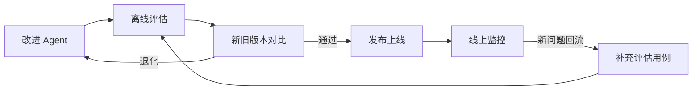

# RefundAgent —— 电商退款处理 Agent

实现一个评估驱动进化的 Agent。

## 持续评估闭环

Agent 的每次改动都先用固定评估集与线上版本对比，通过后再发布；线上发现的新问题经脱敏和标注后回流为评估用例，防止同类问题再次出现。

闭环关注三件事：评估用例与业务规则一致、每次改动没有引入退化、线上失效模式能够沉淀为新的回归用例。完整设计见[持续评估闭环](https://tiltwind.github.io/refund-agent/doc/get-start/2-design.md#六持续评估闭环)。

## 文档

| 文档 | 内容 |
|---|---|
| [0 · 需求](doc/get-start/0-requirement.md) | 业务场景、五步处理 SOP、判定规则与优先级、政策语料范围、验收口径 |
| [1 · 架构](doc/get-start/1-architecture.md) | 整体架构与组件职责、请求链路时序、目录结构与四个目录的边界 |
| [2 · 设计](doc/get-start/2-design.md) | 身份与授权、工具设计、服务接入层与数据源切换、幂等、可观测、评估闭环、技术栈与检索链路 |
| [3 · 政策知识库](doc/get-start/3-rag.md) | 环境、语料、模型层、切片、Milvus 灌库、六步检索链路，含验收清单与故障排查 |
| [4 · 装配 Agent](doc/get-start/4-agent.md) | 身份上下文、服务接入层与规则引擎副本、`agent/v1` 提示与工具、演示入口、埋点 |
| [5 · 指标与数据集](doc/get-start/5-dataset.md) | 从失效模式抽出五个核心指标，再由指标反推数据集覆盖、用例字段与判分实现 |
| [6 · 跑实验](doc/get-start/6-experiment.md) | 跑批与打分脚本、HTML 报告、人工读 trace、ex-1 的关键问题、指标本身的缺口与排期 |
