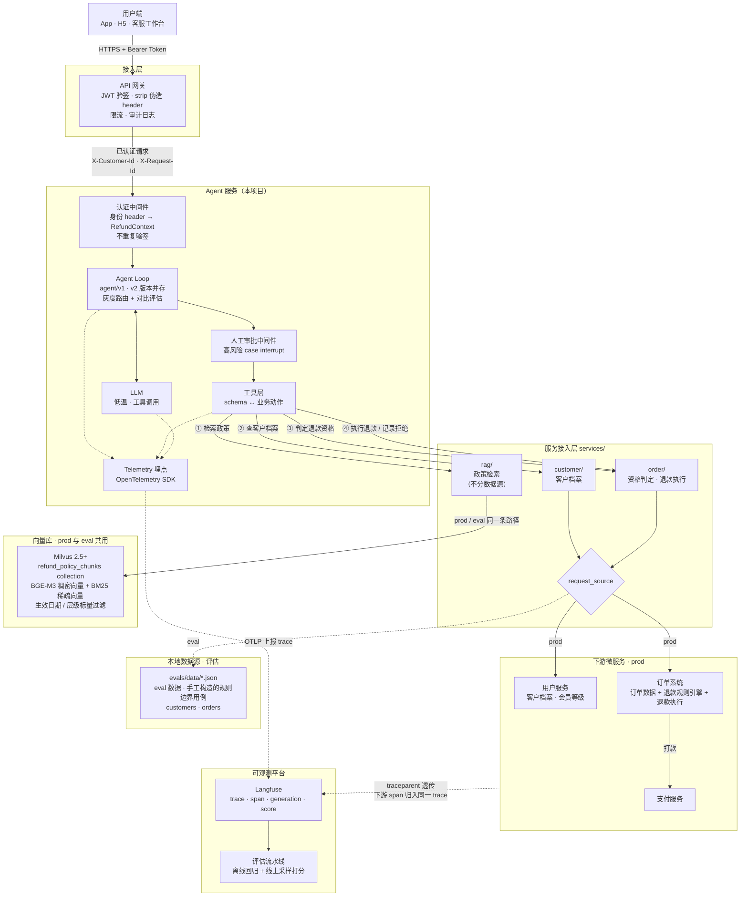
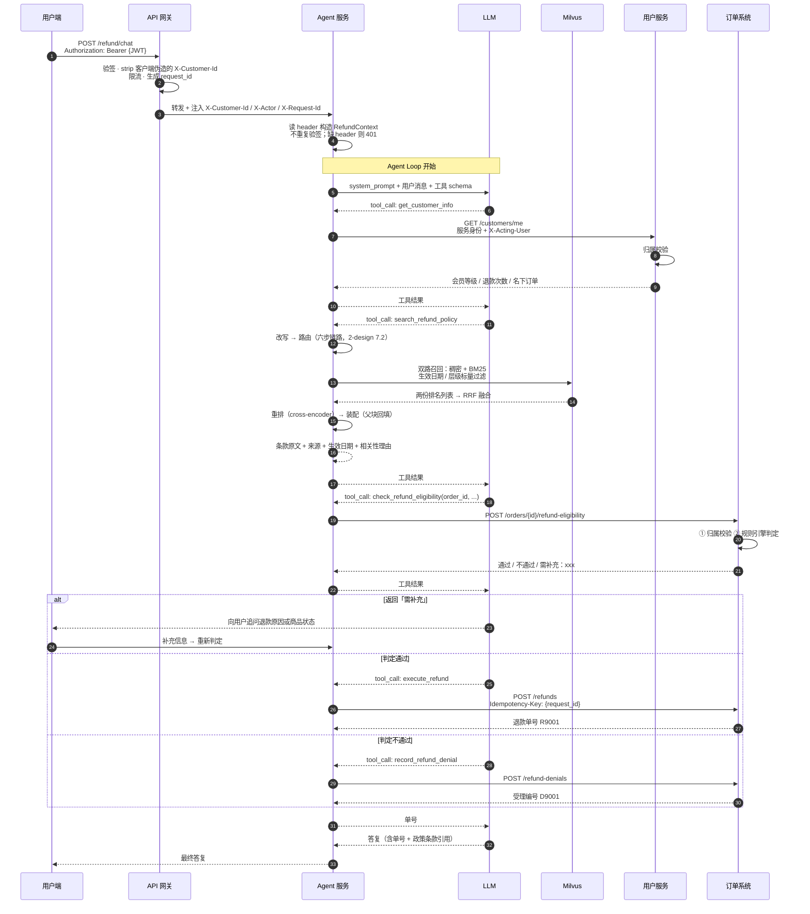

# 1 · 架构：组件、链路与目录

RefundAgent 的系统结构：由哪些组件构成、一次请求怎么流过它们、代码按什么边界分目录。

业务口径见 [0 · 需求](https://github.com/tiltwind/refund-agent/blob/main/doc/get-start/0-requirement.md)，
每一处取舍的理由见 [2 · 设计](https://github.com/tiltwind/refund-agent/blob/main/doc/get-start/2-design.md)，
按步骤把 v1 搭出来见 [3 · 实现](https://github.com/tiltwind/refund-agent/blob/main/doc/get-start/3-impl.md)。
全部代码在 [tiltwind/refund-agent](https://github.com/tiltwind/refund-agent)，文中提到的路径都可以在仓库里直接打开。
代码注释里写的「1-architecture 第一章」这类引用，指的就是本文对应的章节。

---

## 一、整体架构



### 组件职责

| 组件 | 职责 | 明确**不**负责 |
|---|---|---|
| API 网关 | JWT 验签、**strip 客户端伪造的身份 header**、注入身份 header、限流、生成 request_id | 业务逻辑、授权判定 |
| 认证中间件 | 读网关注入的身份 header → 类型化 `RefundContext`；**不重复验签**，缺 header 直接 401 | 验签、授权判定 |
| Agent Loop | 编排工具调用、管理对话状态 | 业务规则 |
| 工具层 | schema ↔ 业务动作的双向翻译 | 业务规则、授权判定、协议细节 |
| **服务接入层** | 下游能力的统一入口；客户档案与订单按 `request_source` 选择 prod / eval 实现，政策检索不分数据源 | 业务规则 |
| Milvus 向量库 | 政策条款混合检索（稠密 + BM25）+ 生效日期过滤；**prod 与 eval 共用同一 collection** | — |
| 用户服务 | 客户档案（**自己做归属校验**） | — |
| 订单系统 | 订单数据 + **退款规则引擎** + 退款执行（**自己做归属校验**） | — |

**关键分工：规则引擎放在订单系统，不放在 Agent 服务。** 理由有三：数据在那边（窗口计算要用签收时间）、授权判定必须在数据所有者一侧、规则变更由订单团队独立发版而不必动 Agent。

---

## 二、请求链路



**「说了」与「做了」的绑定机制**：单号只有真正调用了执行工具才拿得到，而答复里必须写明单号。这样模型无法"只在文字里宣布结果却没落库"——这是 agent 类系统最典型的一类事故。

---

## 三、目录结构（规划）

```
refund-agent/
├── app/                          # 服务外壳
│   ├── main.py                   # FastAPI 入口 + 版本路由
│   ├── context.py                # RefundContext 定义
│   └── middleware/
│       ├── auth.py               # 读网关注入的身份 header → RefundContext
│       └── approval.py           # 人工审批 interrupt
│
├── agent/                        # Agent 版本并存，用于对比评估与灰度
│   ├── v1/                       # 基线：当前线上版本
│   │   ├── prompt.py             # SYSTEM_PROMPT
│   │   ├── graph.py              # create_agent 装配
│   │   ├── tools.py              # 工具定义（schema ↔ 业务动作）
│   │   └── meta.yaml             # 版本号 / 模型 / 温度，随 trace 上报
│   ├── v2/                       # 候选：本次改动
│   │   └── ...
│   └── registry.py               # 版本注册、灰度选择
│
├── services/                     # 服务接入层：下游能力的统一入口
│   ├── base.py                   # 服务身份 + X-Acting-User + traceparent + 重试熔断
│   ├── factory.py                # 按 request_source 选实现（rag 除外，见 2-design 3.4）
│   ├── errors.py                 # EvalDataMissError
│   ├── eval_store.py             # 加载 evals/data + 会话隔离（并发跑批不互相污染）
│   ├── telemetry.py              # OTel 埋点 → Langfuse：trace 属性组装 + PII 脱敏（2-design 5.6）
│   ├── customer/
│   │   ├── protocol.py           # CustomerService 接口 + 数据模型
│   │   ├── prod.py               # → 用户服务
│   │   └── eval.py               # → evals/data/customers.json
│   ├── order/
│   │   ├── protocol.py           # 资格判定 + 退款执行
│   │   ├── prod.py               # → 订单系统（规则引擎在对侧）
│   │   └── eval.py               # → evals/data/orders.json（含本地规则引擎副本）
│   └── rag/
│       ├── protocol.py           # PolicySection（内容+来源+时间+理由）+ RetrievalTrace
│       ├── store.py              # Milvus 连接与字段定义的单一定义点
│       ├── milvus.py             # 六步链路的编排，**唯一实现**，prod / eval 共用
│       └── pipeline/             # 一步一个文件，每步可单独观测（2-design 7.2）
│           ├── rewrite.py        # ① 改写：拆多意图 → 自然语言问句
│           ├── route.py          # ② 路由：平台层 / 法规层的名额与权重
│           ├── filters.py        # ③ 过滤：生效日期 + 层级，只做硬约束
│           ├── recall.py         # ④ 召回融合：稠密 + BM25 → RRF
│           ├── rerank.py         # ⑤ 重排：cross-encoder + 层级/文档先验
│           └── assemble.py       # ⑥ 装配：父块回填 + 去重 + 预算截断
│
├── llm/                          # 模型层：与业务无关，被多条链路共用
│   ├── chat.py                   # 供应商与模型名的唯一解析处（2-design 7.3）
│   ├── device.py                 # cuda > mps > cpu
│   ├── embedding/bge_m3.py       # BGE-M3 稠密向量 + tokenizer 计长（切分要用）
│   └── rerank/bge_reranker.py    # bge-reranker-v2-m3，可关闭（降级打 warn）
│
├── doc/
│   ├── policy/                   # **政策语料的单一事实源**，直接被切片入库
│   │   ├── law/                  # L01-L05 法律法规：法定底线
│   │   └── platform/             # P01-P11 平台政策：与消费者的直接约定
│   ├── get-start/                # 对外教程：0 需求 / 1 设计 / 2 实现
│   └── platform/                 # 依赖服务的本地部署说明（Milvus / Langfuse）
│
├── knowledge/                    # 索引管线（不是 eval 数据）
│   ├── chunking/                 # doc/policy/*.md → 父子块（2-design 7.1）
│   │   ├── model.py              # DocMeta / Chunk；块头拼什么、为什么
│   │   ├── markdown.py           # frontmatter + 标题树 + 段落/表格/代码
│   │   ├── semantic.py           # 超长段落的语义切分兜底
│   │   └── policy.py             # 编排 + 切分参数（320 / 512 / overlap=0）
│   └── seed_milvus.py            # 切片 + 建表 + 灌库，入库前硬卡 token 长度
│
├── evals/
│   ├── data/                     # eval 数据源（JSON）
│   │   ├── customers.json
│   │   └── orders.json           # signed_days_ago 相对天数 + _note 标注守的边界
│   ├── datasets/
│   │   └── cases.jsonl           # 评估用例，单一事实源
│   ├── validate_cases.py         # 数据集自检：期望值 vs 规则引擎
│   ├── offline.py                # 离线回归（单版本）
│   ├── compare.py                # 多版本对比 v1 vs v2
│   ├── online.py                 # 线上采样打分
│   └── archive/                  # 每轮实验的 trace 与报告归档
│
├── scripts/
│   └── milvus.sh                 # 本地 Milvus standalone 的启停（start/stop/status/logs）
│
├── main.py                       # 离线演示入口：跑三个典型场景
├── run-main.sh                   # 加载 .env 后跑 main.py，顺带校验模型凭据齐不齐
├── .env.example                  # 配置占位符（密钥只放 .env，已 gitignore）
└── README.md                     # 仓库索引，正文在 doc/get-start/
```

> v1 已落地的是 `agent/v1`、`services/`、`llm/`、`knowledge/`、`doc/policy/` 与两个入口脚本；
> `app/main.py`、`app/middleware/`、`agent/v2/`、`evals/` 下的评估流水线仍是规划。
> 逐步搭出已落地那部分的过程见 [3 · 实现](https://github.com/tiltwind/refund-agent/blob/main/doc/get-start/3-impl.md)。

**四个目录的边界**：`agent/` 是会变的部分（提示词、流程、工具描述），版本化；`services/` 是稳定的部分（下游能力契约），跨版本共享；`knowledge/` 是业务语料（政策条款原文），与 Agent 版本无关，改版走灌库而不是改代码；`evals/` 消费前三者——用同一套 eval 数据、同一个政策 collection 跑不同 agent 版本，这就是对比实验成立的前提。
