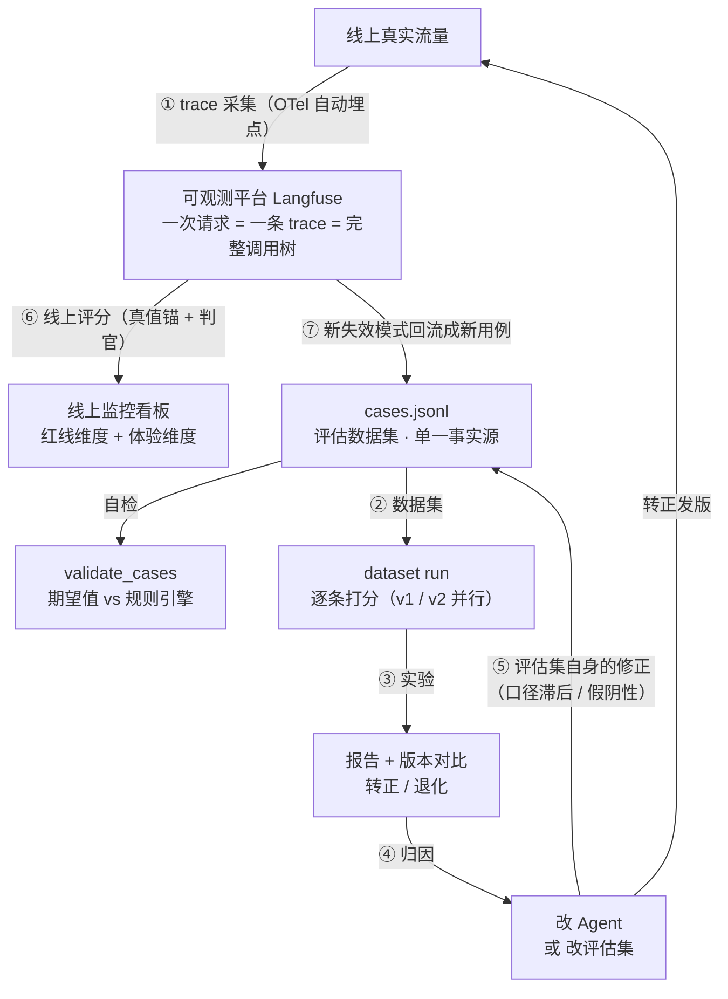

# 2 · 设计

本文给出身份、工具、数据源、幂等、可观测和评估的设计口径。模型负责理解诉求和组织答复；确定性系统负责流程、判定和执行。

相关文档：[0 · 需求](https://tiltwind.github.io/refund-agent/doc/get-start/0-requirement.md) 与 [1 · 架构](https://tiltwind.github.io/refund-agent/doc/get-start/1-architecture.md)。

---

## 一、身份与授权

### 1.1 三类标识，传法不同

| 类型 | 例子 | 来源 | 传递方式 | 模型可见 |
|---|---|---|---|---|
| 主体身份 | `customer_id` | 网关注入（源自 JWT claims） | Context 注入 | ❌ 不可见不可改 |
| 操作者 | `actor`（自助 / 客服代操作） | 网关注入（源自 JWT claims） | Context 注入 | ❌ |
| 资源引用 | `order_id` | 对话文本 | 工具参数 | ✅ 但服务端必须校验归属 |

身份来自认证，不来自对话。`customer_id` 不进入工具 schema。

### 1.2 信任边界：网关与 Agent 的分工

网关完成 JWT 验签并把身份写入 header；Agent 服务只读取 header。

| 职责 | 网关 | Agent 服务 |
|---|---|---|
| JWT 验签、过期校验、吊销检查 | ✅ | ❌ 不重复做 |
| 从 claims 提取 `sub` / `act` / `tenant` | ✅ | ❌ |
| **剥离客户端伪造的同名 header** | ✅ **必做** | — |
| 读取身份 header → `RefundContext` | — | ✅ |
| 授权判定（能不能操作这个订单） | ❌ | ❌ 由下游服务做 |

网关必须先删除客户端传入的同名身份 header，再注入可信值。Agent 服务只接受网关流量，可通过 VPC、mTLS 或服务网格策略隔离。

本项目采用网关注入明文 header、Agent 侧只读 header 的方案，依赖网络隔离与 header strip。外部渠道或零信任、金融级合规场景改用网关换发内部短时 token，Agent 侧校验 `audience=内部服务`。

### 1.3 Context 定义与注入

```python
from dataclasses import dataclass
from fastapi import Header, HTTPException
from langchain.agents import create_agent

@dataclass
class RefundContext:
    customer_id: str            # 主体身份，由网关从 JWT claims.sub 提取后注入
    actor: str = "self"         # self | staff:{staff_id}，审计要用
    request_id: str = ""        # 贯穿全链路的追踪 ID，兼作幂等键
    request_source: str = "prod"  # prod | eval，评估时切换数据源

agent = create_agent(
    model=init_chat_model("anthropic:claude-sonnet-5", temperature=0),
    tools=[search_refund_policy, get_customer_info,
           check_refund_eligibility, execute_refund, record_refund_denial],
    system_prompt=SYSTEM_PROMPT,
    context_schema=RefundContext,
)

# 认证中间件：只读网关注入的 header，不解析 JWT
def build_context(
    x_customer_id: str = Header(None),
    x_actor: str = Header("self"),
    x_request_id: str = Header(None),
) -> RefundContext:
    # 缺 header 直接拒绝，不 fallback 成匿名或默认值
    if not x_customer_id or not x_request_id:
        raise HTTPException(401, "missing gateway identity headers")
    return RefundContext(
        customer_id=x_customer_id,
        actor=x_actor,
        request_id=x_request_id,
    )

# HTTP handler
result = await agent.ainvoke(
    {"messages": [{"role": "user", "content": req.text}]},
    context=build_context(...),
)
```

缺少身份 header 时返回 401，不使用空值或默认租户。

### 1.4 工具侧接住身份

`runtime` 参数**不会出现在发给模型的 tool schema 里**：

```python
from langchain.tools import ToolRuntime

@tool
def get_customer_info(runtime: ToolRuntime[RefundContext]) -> str:
    """查询当前客户的档案：会员等级、近 90 天退款次数、名下订单。"""
    ctx = runtime.context
    return user_client.get_profile(
        customer_id=ctx.customer_id,     # 来自 context，不接受模型传参
        request_id=ctx.request_id,
    )
```

### 1.5 到下游微服务这一跳

调用下游时使用服务身份和 `X-Acting-User`，不透传用户 JWT：

```
Authorization: Bearer <agent 服务自己的 service token>
X-Acting-User:  C1001          ← 代表谁在操作
X-Request-Id:   req-abc-123
```

下游服务负责权限判定。合规要求更高时，可用 OAuth token exchange（RFC 8693）换取面向下游的短时 token。

### 1.6 归属校验必须在下游

```python
# 规则服务侧：订单数据向订单系统取，带上 acting_user
def check_eligibility(order_id, acting_user):
    order = order_api.get(order_id, acting_user=acting_user)
    # 「不存在」与「不属于当前客户」返回同一句话
    if not order:
        return Result(passed=False, reason=f"订单 {order_id} 不存在")
```

归属校验由数据所有者执行，Agent 无权绕过。规则服务把「取不到」翻译成一句业务结论。

---

## 二、工具设计

| 工具 | 下游 | 模型可填参数 | Context 注入 | 副作用 |
|---|---|---|---|---|
| `search_refund_policy` | Milvus | `query` | — | 无 |
| `get_customer_info` | 用户服务 | **无** | `customer_id` | 无 |
| `check_refund_eligibility` | 规则服务 | `order_id`, `reason_type`, `item_condition` | `customer_id` | 无 |
| `execute_refund` | 订单系统 | `order_id`, `amount`, `reason` | `customer_id`, `request_id` | **打款** |
| `record_refund_denial` | 订单系统 | `order_id`, `reason` | `customer_id`, `request_id` | 落库 |

### 设计约束

参数取值由代码校验，docstring 只用于说明：

```python
REASON_TYPES = ("无理由", "质量问题")

if reason_type and reason_type not in REASON_TYPES:
    return (f"参数错误：reason_type 只能是「无理由」或「质量问题」，"
            f"收到「{reason_type}」。请按用户实际诉求重新判断后再次调用。")
```

参数错误返回可纠正的提示，供模型修正后重试。

`需补充` 由规则引擎返回。规则服务先检查不存在、已退款、类目黑名单、高风险和超出最宽窗口等硬否决；只有结果取决于缺失参数时才要求补充。

---

## 三、服务接入层与数据源切换

### 3.1 工具层只调 `services/`

工具层不直接访问下游，统一走 `services/`：

1. 数据源由 `request_source` 切换，离线评估读本地数据；政策检索始终连 Milvus，见 3.4；
2. REST、gRPC 等协议细节封闭在具体实现里；
3. 服务身份、`traceparent`、重试、熔断和超时集中在 `services/base.py`。

### 3.2 一个服务 = 一个接口 + 按需的实现

```python
# services/customer/protocol.py —— 接口定义，工具层只依赖它
from typing import Protocol

class CustomerService(Protocol):
    def get_profile(self, customer_id: str) -> CustomerProfile: ...

# services/factory.py —— 按 request_source 选实现
def customer_service(ctx: RefundContext) -> CustomerService:
    match ctx.request_source:
        case "prod":    return ProdCustomerService(ctx)      # HTTP → 用户服务
        case "eval": return EvalCustomerService(ctx)   # 读 data/customers.json
        case other:     raise ValueError(f"unknown request_source: {other}")
```

工具层只依赖 `CustomerService` 接口：

```python
@tool
def get_customer_info(runtime: ToolRuntime[RefundContext]) -> str:
    ctx = runtime.context
    profile = customer_service(ctx).get_profile(ctx.customer_id)
    return render_profile(profile)      # 渲染成 LLM 好读的文本
```

未知的 `request_source` 直接报错，不回退到 prod。客户、规则和订单服务各有 prod、eval 实现；RAG 只有 Milvus 实现。

### 3.3 eval 数据格式

手工构造，**每条对应一个规则分支**，`_note` 字段写明它守的是哪条边界：

```jsonc
// evals/data/orders.json
{
  "O2011": {
    "customer_id": "C1006",
    "product": "羊绒大衣",
    "category": "服饰",
    "price": 1580.00,
    "signed_days_ago": 15,          // 相对天数，不是绝对时间戳
    "refunded": false,
    "_note": "金牌窗口边界内：15 == 15，判定条件是 > window，应通过"
  },
  "O2012": {
    "customer_id": "C1006",
    "signed_days_ago": 16,
    "_note": "金牌窗口边界外：16 > 15，超出一天也应拒绝"
  }
}
```

时间使用 `signed_days_ago`，避免固定时间戳导致窗口用例过期。数据缺失时抛 `EvalDataMissError`，用例记为 `invalid`。当前不支持录制回放。

### 3.4 RAG 不切数据源

`prod` 和 `eval` 使用同一个 Milvus collection。影响检索结果的变量按下表控制：

| 变量 | 做法 |
|---|---|
| 政策改版、重新灌库 | collection **按版本发布**（`refund_policy_chunks_v3`），评估固定指向某个版本；线上灰度切换，不在原 collection 上原地 drop 重建 |
| embedding 模型升版本 | 灌库与检索共用同一个 `llm.embedding.embedder()`；模型版本随 `agent_version` 记进 trace，换模型视同一次发版，重跑基线 |
| 切分参数（块大小 / 父块粒度） | 参数集中在 [`rag/chunking/policy.py`](https://github.com/tiltwind/refund-agent/blob/main/rag/chunking/policy.py)，与 collection 版本绑定发布；调参后重跑检索基线 |
| 索引参数（nlist / ef） | 稠密一路用 `FLAT` 精确检索，无此类参数 |
| 查询改写的 LLM 抖动 | 改写模型固定版本、温度 0，改写结果记进 trace；`REFUND_AGENT_REWRITE=off` 可整体关闭，见 [`rag/retrieving/pipeline/rewrite.py`](https://github.com/tiltwind/refund-agent/blob/main/rag/retrieving/pipeline/rewrite.py) |
| collection 空 / 灌库没跑 | 检索返回空时**显式抛错**，不让 Agent 带着「未检索到条款」继续判定 |

回归波动时，先检查 `tool.search_refund_policy` 的返回和六步检索 trace，再检查 Agent。检索另用 query → section 数据集计算 recall@k 和 MRR。CI 需要启动 Milvus 并运行 [`rag/index/seed_milvus.py`](https://github.com/tiltwind/refund-agent/blob/main/rag/index/seed_milvus.py)。

---

## 四、幂等与终局动作

退款是资金操作，**必须幂等**。

- 幂等键用 `request_id`（网关生成，贯穿全链路），随 `Idempotency-Key` header 发给订单系统
- 订单系统对同一幂等键返回**同一个退款单号**，不重复打款
- Agent 侧重试（超时、5xx）携带相同幂等键

**高风险 case 走人工审批**：金额超阈值、风控命中、判定为边界值时，用 LangGraph 的 `interrupt` 挂起，等人工确认后恢复。审批状态由 checkpointer 持久化，服务重启不丢。

**审计流水字段**：`decision`、`refund_no`、`order_id`、`amount`、`reason`、`actor`、`request_id`、`trace_id`、`policy_refs`，其中 `actor` 与 `request_id` 必填。

---

## 五、可观测性：Telemetry → Langfuse

Agent 服务通过 OpenTelemetry SDK 和 OTLP 向 Langfuse 上报 trace。trace 同时用于排障和评估数据回流。

### 5.1 一次请求 = 一条 trace

```
trace: refund-chat  [request_id=req-abc-123, user=C1001, session=sess-77]
└── span  agent.loop
    ├── generation  llm.call
    ├── span  tool.get_customer_info
    │   └── span  http.user_svc
    ├── span  tool.search_refund_policy
    │   └── retriever  rag.search_policy
    │       ├── span  rag.rewrite
    │       │   └── generation  llm.call
    │       ├── span  rag.route
    │       ├── span  rag.recall
    │       ├── span  rag.rerank
    │       └── span  rag.assemble
    ├── span  tool.check_refund_eligibility
    │   └── span  http.order_svc
    └── span  tool.record_refund_denial
```

span 按调用关系嵌套：`tool.*` 包含对应的 `http.*`，RAG 工具包含各检索步骤。

### 5.2 埋点要素

| 层级 | 必记字段 |
|---|---|
| trace | `request_id`、`customer_id`（脱敏后的稳定哈希）、`session_id`、`agent_version`、`prompt_version` |
| generation | 模型名、温度、input/output token、耗时、finish_reason |
| tool span | 工具名、入参、返回、耗时、是否报错、重试次数 |
| http span | 下游服务名、路由、状态码、`traceparent` |

`prompt_version` 和 `agent_version` 用于把指标变化归因到具体版本。

### 5.3 跨服务传播

通过 W3C `traceparent` 向下游传播 trace context。

`clients/base.py` 统一处理三件事，业务代码不用管：注入服务身份 token、注入 `X-Acting-User`、注入 `traceparent`。

```python
class DownstreamClient:
    def _headers(self, ctx: RefundContext) -> dict:
        headers = {
            "Authorization": f"Bearer {self._service_token()}",
            "X-Acting-User": ctx.customer_id,
            "X-Request-Id": ctx.request_id,
        }
        inject(headers)          # opentelemetry.propagate.inject → traceparent
        return headers
```

### 5.4 脱敏

写入 span 属性前统一脱敏手机号、地址、支付账户和真实姓名。Langfuse 与评估读取同一份脱敏数据。

### 5.5 Trace 归档

每轮实验按 `run_name` 归档原始 trace，避免受 Langfuse 保留策略影响。

### 5.6 当前实现进度

本章其余部分是目标形态，v1 落地的是 [`services/telemetry.py`](https://github.com/tiltwind/refund-agent/blob/main/services/telemetry.py) 这一层：

| 项 | 状态 |
|---|---|
| 一次请求 = 一条 trace，图节点 / 工具 / generation 自动成树 | ✅ Langfuse `CallbackHandler` 接 LangGraph 回调，不自建 tracer provider |
| trace 属性：`request_id`、`session_id`、脱敏后的 `customer_id`、`agent_version`、`prompt_version`、`request_source` | ✅ 由 `trace_config()` 组装，埋点走 `invoke` 的 `config`，与业务身份的 `context` 分开 |
| PII 脱敏（5.4） | ✅ 挂在 SDK 的 `mask` 钩子上，所有 span 的 input/output 统一过一遍 |
| `rag.recall` / `rag.rerank` / `rag.assemble` 子 span | ✅ 六步在 [`milvus.py`](https://github.com/tiltwind/refund-agent/blob/main/rag/retrieving/milvus.py) 里各包一层，根节点是 `rag.search_policy`（retriever 类型）；候选与证据的 `chunk_id` 序列进 span 的 output |
| 跨服务 `traceparent` 透传（5.3） | ❌ v1 全走 eval 数据源，尚无下游 HTTP 调用 |
| scores 异步写回 | ❌ 属第六章的评估闭环 |

短命脚本退出前显式 `flush`；启动时运行 `auth_check`。缺少 key 时关闭埋点，不影响主链路。

---

## 六、持续评估闭环

评估流程覆盖改动、度量、归因和用例回流。

### 6.1 完整闭环



失败用例要区分 Agent 缺陷和评估口径错误；线上出现的新失效模式要加入离线数据集。

### 6.2 三层评估，各管各的事

| 层 | 回答的问题 | 数据来源 | 真值来源 | 成本 | 频率 |
|---|---|---|---|---|---|
| **数据集自检** | 期望值和规则还对得上吗 | `cases.jsonl` | 规则引擎 | 零（不调模型） | 每次改规则 |
| **离线回归** | 这次改动有没有让它变差 | eval 数据 + 固定用例集 + 固定版本的政策 collection | `expected_output` | 一轮几分钟 | 每次改 Agent |
| **线上监控** | 真实流量是否异常 | 生产 trace | 规则引擎返回（trace 内自洽） | 判官调用费 | 持续 |

离线 `decision_match` 使用预标注答案；线上以 trace 中 `check_refund_eligibility` 的返回值为真值。

### 6.3 离线评估不连线上业务服务

`RefundContext.request_source` 是切换点：`prod` 走真实微服务，`eval` 读 `evals/data/*.json`（详见第三章）。**同一份工具代码、同一条代码路径**，区别只在入口注入的 context。

唯一的外部依赖是 **Milvus**（2.5+，BM25 Function 需要）：政策检索不切数据源，评估跑批同样连真实向量库（3.4），评估环境固定 collection 版本。嵌入与重排跑在本地（`llm/`），CI 预热模型缓存，约 4.4 GB 权重。

`request_source` 只能由环境变量、评估流水线或可信网关注入，客户端不能指定。

三条硬约束：

1. **终局动作必须 stub**。`execute_refund` 在评估模式下只记录调用意图，不发起打款——断言"是否调用 + 参数是否正确"即可。
2. **时间相对化**。eval 数据使用 `signed_days_ago`，不使用绝对时间戳。
3. **PII 脱敏**。真实客户数据不进评估日志和 LLM judge 的 prompt。

### 6.4 多版本并存与对比

Agent 的每次改动（提示词、流程、模型、工具描述）都构成一个新版本，`agent/` 下按版本目录**并存**而非原地覆盖：

```
agent/
├── v1/            # 基线：当前线上版本
│   ├── prompt.py
│   ├── graph.py
│   └── meta.yaml  # 版本元信息，随 trace 上报
├── v2/            # 候选：本次改动
└── registry.py    # 版本注册与选择
```

并存后按下表使用：

| 场景 | 做法 |
|---|---|
| **同集对比** | 同一数据集同时跑 v1/v2，逐条 diff |
| **退化定位** | 取 v1 过、v2 挂的用例集合 |
| **灰度回滚** | 线上按流量比例路由，指标不对切回 v1 |
| **线上归因** | trace 里记 `agent_version`，按版本切分指标 |

```python
# evals/compare.py —— 只负责跑，报告另从 Langfuse 生成
for version in ("v1", "v2"):
    run_dataset(
        agent=registry.get(version),
        dataset="refund-cases-v3",
        run_name=f"{version}-{git_sha}",
        context=RefundContext(request_source="eval", ...),
    )

# app/main.py —— 线上按灰度比例路由，并写入 trace 属性
agent = registry.select(rollout={"v1": 0.9, "v2": 0.1})
```

**实验纪律：每轮只改一处。** 对比报告必须能回答三个问题：总通过率变了吗、哪些用例由过变挂、这些退化是真退化还是评估集口径问题。

### 6.5 数据集来源与回流

- **手工构造的规则边界用例**（窗口 15 vs 16、阈值 3 vs 4、类目黑名单、重复退款）：覆盖全部规则分支
- **线上 trace 脱敏后标注**：补真实数据分布
- **线上 badcase / 用户投诉**：按闭环 ⑦ 持续回流

新增用例先过 `validate_cases` 自检：把期望值喂给规则引擎，不自洽的用例直接拦下。改规则引擎后同样先跑它，不调模型。

---

## 七、技术栈

| 层 | 选型 |
|---|---|
| Agent 框架 | LangChain 1.x `create_agent` + LangGraph |
| 模型 | Claude Sonnet 5，`temperature=0`；同时支持 OpenAI 及其兼容网关（DeepSeek / Qwen / vLLM / one-api），选哪家由 `llm/chat.py` 统一解析，见 7.3 |
| **向量库** | **Milvus 2.5+**——Agent 直连（不经知识库服务），政策条款 collection，稠密 + 稀疏双向量，标量字段（`effective_date` / `expire_date` / `layer`）支持过滤检索 |
| 嵌入 / 重排 | **BGE-M3**（稠密，1024 维）+ **bge-reranker-v2-m3**（交叉编码），本地运行，代码在 `llm/` |
| 状态持久化 | LangGraph checkpointer（人工审批挂起 / 恢复） |
| 可观测 | OpenTelemetry + Langfuse |
| 评估 | Langfuse dataset run + 自建规则引擎真值锚 |
| 下游通信 | HTTP / gRPC，**不引入 MCP**（见 7.4） |

### 7.1 离线索引：doc/policy 变成了什么

[`doc/policy/`](https://tiltwind.github.io/refund-agent/doc/policy) 下的 Markdown 是语料的唯一来源，灌库脚本直接切分文档。

```
16 篇 Markdown（法规 5 + 平台 11）
  → frontmatter 解析（doc_id / layer / effective_date / authority_level …）
  → 按标题层级切：父块 = 一个 `##` 小节（一章 / 一条完整规则）
  → 父块内按段落切：子块 = 检索单元，目标 320 / 硬上限 512 token
      表格与代码块原子化，不拆开
      超长自然段 → 语义切分兜底
  → 每个子块加块头：【文档】+【路径】
  = 353 个子块 / 174 个父块，overlap = 0
```

切分采用四项约束：按语义边界切分且 `overlap=0`；块头只放文档标题和标题路径；父块粒度为 `##`；入库前检查 token 长度，`truncated > 0` 时失败。生效日期和 tags 存入标量字段。

### 7.2 在线检索：一次请求的六次数据形变

```
改写 → 路由 → 过滤 → 召回融合 → 重排 → 装配
```

每一步在 [`rag/retrieving/pipeline/`](https://github.com/tiltwind/refund-agent/tree/main/rag/retrieving/pipeline) 下有独立模块：

| 步骤 | 做什么 | 出错的表现 |
|---|---|---|
| 1 改写 | 拆多意图、判断要不要法规层；**输出自然语言问句** | 检索到的完全是另一类问题的条款 |
| 2 路由 | 平台层 / 法规层各给多少名额与权重 | 该引平台条款却引了法条 |
| 3 过滤 | 生效日期 + 层级，**只做硬约束** | 明明有条款却一条没召回 |
| 4 召回融合 | 稠密 + BM25 双路 → RRF（k=20） | 召回了但排名靠后 |
| 5 重排 | cross-encoder + 层级/文档先验 | 候选里有正确答案但没顶上来 |
| 6 装配 | 父块回填 + 去重 + 相邻合并 + 预算截断 | 上下文里有证据但答复没用上 |

BM25 负责数字、类目等精确词项，稠密检索负责语义匹配。BM25 由 Milvus 的中文分析器和 BM25 Function 计算。RRF 融合在应用层完成，各路排名记进 trace。

查询改写输出自然语言问句。生效日期只用于硬过滤，不参与 freshness 加权；排序先验为平台层优先、P02 优先。

改写失败时使用原查询；重排不可用时使用融合分和先验；嵌入不可用或检索为空时直接报错。当前权重、阈值和 RRF 参数只是初始值，需要用 query → section 标注集校准。

### 7.3 模型接入：两家供应商与兼容网关

Agent 主循环和查询改写都通过 [`llm/chat.py`](https://github.com/tiltwind/refund-agent/blob/main/llm/chat.py) 解析模型配置。

供应商优先级：`REFUND_AGENT_PROVIDER` > 唯一已配置凭据的供应商 > Anthropic（两组凭据均存在时）。

**用哪个模型**（优先级从高到低）：

| 来源 | 说明 |
|---|---|
| `REFUND_AGENT_MODEL` / `REFUND_AGENT_REWRITE_MODEL` | 跨供应商的强制覆盖，可带前缀（`openai:qwen-max`） |
| `OPENAI_MODEL` / `ANTHROPIC_MODEL` | 按当前供应商取 |
| 调用方给的默认值 | **仅当它属于当前供应商** |
| 兜底 | 改写回落到主模型；主模型在 openai 侧直接报错 |

调用方默认值只在供应商一致时生效，OpenAI 侧不设内置默认值。

端点按模型前缀选择。OpenAI 侧同时识别 `OPENAI_BASE_URL` 和 `OPENAI_API_BASE`。

查询改写要求模型返回 Pydantic 结构。部分 OpenAI 兼容网关不支持 LangChain 默认的 `json_schema`：

| 方式 | 结果 |
|---|---|
| `json_schema`（langchain 默认） | ✗ `This response_format type is unavailable now` |
| `json_mode` | ✗ 还要求 prompt 里出现 "json" 字样 |
| `function_calling` | ✓ 但需关掉思考模式（见下） |

OpenAI 侧默认使用 `function_calling`。推理模型若不接受 `tool_choice`，设置 `REFUND_AGENT_REWRITE_REASONING=none`；非推理模型不要设置该参数。

改写失败时使用原查询；`REFUND_AGENT_REWRITE=off` 可关闭改写。

### 7.4 MCP

当前不引入，工具与 Agent 同仓同周期发布。出现跨团队复用需求后，先迁移 `get_customer_info` 等只读通用工具；写操作和业务规则留在业务服务内。
