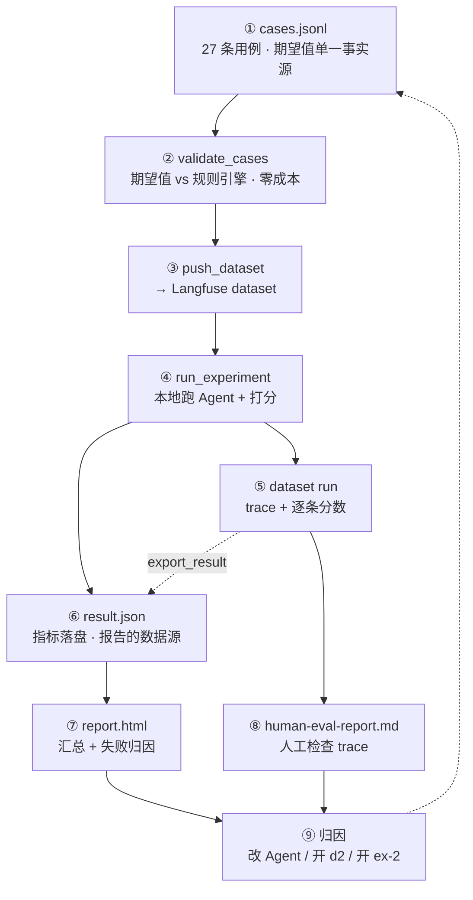

# 4 · 准备数据集与制定指标

本篇以数据集 `d1` 为例，说明用例格式、设计约束和评分规则。实验运行与报告见 [5 · 跑实验](https://tiltwind.github.io/refund-agent/doc/get-start/5-experiment.md)，整体设计见 [2 · 设计 · 六](https://tiltwind.github.io/refund-agent/doc/get-start/2-design.md#六持续评估闭环)。

---

## 一、评估流程



| 产物 | 位置 | 作用 |
|---|---|---|
| 用例集 | [`evals/dataset/d1/cases.jsonl`](https://github.com/tiltwind/refund-agent/blob/main/evals/dataset/d1/cases.jsonl) | 期望值的单一事实源 |
| 数据集说明 | [`evals/dataset/d1/README.md`](https://github.com/tiltwind/refund-agent/blob/main/evals/dataset/d1/README.md) | 绑定关系、覆盖矩阵、扩展规则 |
| 数据集自检 | [`evals/validate_cases.py`](https://github.com/tiltwind/refund-agent/blob/main/evals/validate_cases.py) | 检查用例与规则引擎的一致性 |
| 推送脚本 | [`evals/push_dataset.py`](https://github.com/tiltwind/refund-agent/blob/main/evals/push_dataset.py) | cases.jsonl → Langfuse dataset |

---

## 二、数据集：格式与设计

### 2.1 一条用例的完整范例

每行一个 JSON 对象。下面是 `D1-011` 的全文（注释是说明，实际文件里没有）：

```jsonc
{
  "case_id": "D1-011",                                 // 全集唯一，兼作 Langfuse dataset item id
  "title": "金牌会员窗口优待：10 天无理由退货",
  "tags": ["window", "member_level", "approve"],       // 报告里按标签切片看
  "priority": "P0",                                    // P0 红线（身份/判定/落库）· P1 体验与覆盖

  "context": {                                         // 评估流水线构造 RefundContext，不来自请求体
    "customer_id": "C1001",                            // 身份来自认证，不从对话文本提取
    "actor": "self",
    "request_id": "d1-011",                            // 全集唯一，兼作幂等键
    "request_source": "eval"                           // 切到 evals/data/*.json，不连线上服务
  },

  "turns": [                                           // 多轮：runner 累积 messages 后逐轮 invoke
    {
      "user": "你好，订单 O2001 的耳机买回来一直没拆封，现在不想要了，想无理由退货。",
      "expected": {
        "outcome": "approved",                         // approved | denied | clarify | ask_order_id

        "eligibility": {                               // 真值锚：validate_cases 拿它去问规则引擎
          "probe": {                                   // 「规范探针」，不是对模型传参的断言
            "order_id": "O2001",
            "reason_type": "无理由",
            "item_condition": "未拆封"
          },
          "verdict": "通过",                            // 通过 | 不通过 | 需补充
          "reason_contains": ["符合「无理由」退款条件",
                              "签收 10 天 ≤ 窗口 15 天"],
          "refundable_amount": 899.0
        },

        "tools": {
          "must_call": ["get_customer_info", "search_refund_policy",
                        "check_refund_eligibility", "execute_refund"],
          "must_not_call": ["record_refund_denial"],
          "order": ["get_customer_info", "search_refund_policy",
                    "check_refund_eligibility", "execute_refund"],   // 子序列约束
          "max_calls": {"search_refund_policy": 2}     // 软指标：一次检索够用
        },

        "decision_log": {"decision": "批准",            // 落库断言；不该落库的轮次写 null
                         "order_id": "O2001", "amount": 899.0},

        "answer": {
          "must_include_receipt_no": true,             // 单号必须来自本轮真实落库的那一笔
          "must_mention": ["金牌", "899"],              // 软指标
          "must_not_mention": []                       // 硬指标：他人姓名 / 他人订单金额
        },

        "citation": {"prefer_docs": ["P07", "P02"]}    // 软指标：依据有没有被召回
      }
    }
  ],

  "_note": "10 > 普通 7 但 ≤ 金牌 15：会员等级参与窗口判定，等级读错就会误拒。"
}
```

### 2.2 字段速查

| 字段 | 类型 | 谁读它 | 硬/软 |
|---|---|---|---|
| `context` | 对象 | 跑批时构造 `RefundContext` | — |
| `turns[].user` | 字符串 | 喂给 Agent 的用户消息 | — |
| `outcome` | 枚举 | `decision_match` | 硬 |
| `eligibility.probe` | 对象 | `validate_cases` 离线复算 | 不进跑批 |
| `eligibility.verdict` / `reason_contains` / `refundable_amount` | — | `validate_cases` | 不进跑批 |
| `tools.must_call` / `must_not_call` / `order` | 列表 | `tool_sequence` | 硬 |
| `tools.max_calls` | 对象 | `search_economy` | 软 |
| `decision_log` | 对象 or `null` | `log_match` | 硬 |
| `answer.must_include_receipt_no` | 布尔 | `receipt_in_answer` | 硬 |
| `answer.must_not_mention` | 列表 | `no_leak` | 硬 |
| `answer.must_mention` | 列表 | `mention_hit` | 软 |
| `citation.prefer_docs` | 列表 | `citation_hit` | 软 |
| `run` | 对象 | `idempotent_replay` | 硬 |
| `_note` | 字符串 | 给人读，不参与判分 | — |

### 2.3 多轮与重放

多轮用例把 `turns` 写成两条，每轮各有独立的 `expected`。追问轮的写法（`D1-020` 第 1 轮）：

```jsonc
{
  "user": "订单 O2004 我想退掉。",
  "expected": {
    "outcome": "clarify",
    "tools": {"must_call": ["check_refund_eligibility"],
              "must_not_call": ["execute_refund", "record_refund_denial"], "order": []},
    "decision_log": null,                              // clarify / ask_order_id 一律不落库
    "answer": {"must_include_receipt_no": false, "must_mention": ["质量问题"]},
    "citation": {"prefer_docs": []}
  }
}
```

重放用例（`D1-027`）额外声明 `run`，跑批时按它连跑两遍：

```jsonc
"run": {"repeat": 2, "share_session": true,
        "expected": {"decision_log_rows": 1, "same_receipt_no": true}}
```

退款是资金操作，重放产生第二笔就是重复打款事故，所以 `idempotent_replay` 算硬指标。

### 2.4 设计约束

| 约束 | 说明 |
|---|---|
| 一条用例只覆盖一条边界 | `_note` 记录对应的规则分支或验收口径，失败时可直接定位 |
| 时间使用 `signed_days_ago` | 绝对时间戳会使窗口类用例随时间失效 |
| `probe` 只用于规则引擎复算 | 硬否决类用例留空 `reason_type` / `item_condition`；模型传参由 `tools` 断言校验 |
| `order` 按子序列匹配 | 允许在规定顺序之间插入重试或补充检索 |
| 文本去空白后做子串比对 | `"7 天"` 与 `"7天"` 视为相同 |
| 软指标不参与 pass/fail | `citation_hit`、`mention_hit`、`search_economy` 只记录分数 |
| 期望值只保存在 `cases.jsonl` | 实验目录不保留副本 |

### 2.5 版本绑定

用例期望值依赖以下版本；任一项变化后都需要重新验证：

| 绑定项 | 当前值 | 变更后的影响 |
|---|---|---|
| eval 数据 fixture | `evals/data/customers.json` C1001–C1006<br>`evals/data/orders.json` O2001–O2014 | 改一个 `signed_days_ago` 就会让若干条用例的期望值静默失效 |
| 规则引擎副本 | [`services/order/eval.py`](https://github.com/tiltwind/refund-agent/blob/main/services/order/eval.py) | 窗口 / 阈值 / 黑名单口径变了，先跑 `validate_cases` |
| 政策 collection | `MILVUS_COLLECTION`（默认 `refund_policy_chunks`） | 政策改版重新灌库后，`citation_hit` 会漂移 |
| 被测 Agent | `agent/v1`（`prompt_version` 见 `meta.yaml`） | 版本对比时保持数据集不动，只换 agent 版本 |

### 2.6 覆盖矩阵与「明确不覆盖」

d1 的 README 包含规则分支 → 用例、SOP 与验收口径 → 用例两张覆盖矩阵。边界用例成对设置，例如普通会员 7 ✓ / 8 ✗、金牌 15 ✓ / 16 ✗。

d1 不覆盖以下范围：

| 未覆盖 | 原因 / 去处 |
|---|---|
| 工具层参数校验 | 自然语言难以稳定触发，属单元测试范畴 |
| 客服代操作（`actor=staff:*`） | v1 无差异化逻辑，等审批流落地后补 |
| 检索质量本身（recall@k / MRR） | 另建 query→section 的 retrieval 数据集 |
| 人工审批 interrupt / 恢复 | 尚未实现 |
| 部分退款、运费与优惠券重算 | 规则引擎当前不支持 |
| 线上真实分布（脏数据、字段缺失） | 靠线上回流补，手工构造造不出真实分布 |

---

## 三、自检与推送

### 3.1 自检

```bash
python evals/validate_cases.py                    # 默认校验 evals/dataset/d1
```

该命令不调用模型或 Milvus。修改规则引擎或用例后应先运行，检查四类不一致：

| 检查 | 抓什么 |
|---|---|
| 真值锚偏移 | `probe` 输入规则引擎后，verdict / 文案 / 可退金额与用例期望不一致 |
| 结论自相矛盾 | `outcome=approved` 却期望 verdict=不通过；批准金额与可退金额不等；落库方向写反 |
| 工具断言与结论不符 | 批准类用例没要求调 `execute_refund`，或没禁掉 `record_refund_denial` |
| 数据引用悬空 | 用例引用的客户不在 fixture 里；`request_id` 撞车（它兼作幂等键，撞车会让两条用例互相认领对方的退款单号） |

### 3.2 推送：一条用例拆成三块

```bash
python evals/push_dataset.py --dry-run            # 只打印，不连 Langfuse
python evals/push_dataset.py                      # → 数据集 refund-cases-d1
```

| 字段 | 放什么 | 谁读它 |
|---|---|---|
| `input` | 喂给 Agent 的东西：`context` + 每轮的 user 文本 | 跑批时的 task 函数 |
| `expected_output` | 判分依据：每轮的 `expected`，原样搬过去 | 打分器 |
| `metadata` | 标题 / 标签 / 优先级 / 备注 | UI 筛选与报告 |

Langfuse item id 使用 `case_id`。重复推送时按 id 更新，不新增副本。

---

## 四、指标设计

### 4.1 三处来源

| 来源 | 产出 |
|---|---|
| [0 · 需求](https://tiltwind.github.io/refund-agent/doc/get-start/0-requirement.md) 第五节的六条验收口径（身份 / 判定 / 落库 / 引用 / 审计 / 幂等） | 指标清单的骨架 |
| 判定规则的分支表（订单有效性 / 风控 / 黑名单 / 窗口 / 商品状态） | 变成**用例覆盖矩阵**，不产生新指标 |
| 五步 SOP（调用顺序与追问条件） | `tool_sequence` |

规则分支决定用例覆盖，不增加指标。指标衡量 Agent 是否按约定执行，规则本身由规则引擎验证。

### 4.2 两条筛选规则

1. **仅使用 trace 中可确定计算的字段。** v1 的九个指标均不调用模型，可离线重复计算；不评价答复风格等主观维度。

2. **检索波动不参与 pass/fail。** `citation_hit` 等指标只记录分数。

### 4.3 验收口径 → 指标：覆盖是不均匀的

| 验收口径 | 对应指标 | 覆盖程度 |
|---|---|---|
| 身份：只操作当前认证客户的订单 | `no_leak` + 规则引擎兜底 | 完整：`acting_user` 由 context 注入 |
| 判定：结果与规则引擎一致 | `rule_consistency` + `decision_match` | 完整 |
| 落库：批准拒绝都落库、答复带单号 | `log_match` + `receipt_in_answer` | 部分：只比较 `decision` / `order_id` / `amount` |
| 引用：只引用检索到的政策条款 | `citation_hit` | 部分：只检查依据是否召回，不检查答复引用 |
| 审计：流水含 `actor` 和 `request_id` | 无 | 无指标（实现上由 context 注入结构性保证） |
| 幂等：同一 `request_id` 不重复打款 | `idempotent_replay` | 完整 |
| 自动闭环率 ≥ 70% | 无 | 无指标 |

未完整覆盖的项目及补充优先级见 [5 · 跑实验 · 六](https://tiltwind.github.io/refund-agent/doc/get-start/5-experiment.md#六指标缺口)。

---

## 五、评分规则

硬指标决定用例是否通过，软指标只记录分数。

### 5.1 判分只看这四样东西

九个指标均为纯函数，输入为每轮执行后从 messages 提取的四个字段：

| 字段 | 内容 | 怎么来的 |
|---|---|---|
| `tools` | 本轮工具调用序列：`[{name, args}, …]` | 遍历本轮新增的 AI 消息，取 `tool_calls` |
| `tool_results` | 按工具名分组的返回文本：`{name: [文本, …]}` | 本轮 `type == "tool"` 的消息 |
| `answer` | 给用户的答复 | 最后一条**非空**的 AI 文本（带 `tool_calls` 的 AI 消息 text 是空的） |
| `new_log` | 本轮新增的决策流水行 | 调用前后 `eval_store.decision_log()` 的差集 |

所有文本比对都先去掉全部空白再做子串匹配（`_norm`），`"7 天"` 与 `"7天"` 视为同一个。

### 5.2 硬指标：怎么算的

| 指标 | 取什么 | 判 1 的条件 |
|---|---|---|
| `decision_match` | `new_log` + `tools` | 反推出的 outcome 与 `expected.outcome` 字符串相等 |
| `rule_consistency` | `tool_results["check_refund_eligibility"]` + 反推的 outcome | 规则引擎最后一次判定与实际结论方向一致 |
| `tool_sequence` | `tools` 的名称序列 | `must_call` 全在、`must_not_call` 全不在、`order` 是名称序列的子序列，三者同时满足 |
| `receipt_in_answer` | `answer` + `new_log` | 见下 |
| `log_match` | `new_log` | 见下 |
| `no_leak` | `answer` | `must_not_mention` 每一项去空白后都不是 `answer` 的子串 |
| `idempotent_replay` | 整条用例的重放记录 | 流水行数 == `decision_log_rows`，且 `same_receipt_no` 时两次单号相同 |

**`decision_match`：从执行记录推导 outcome。**

```python
rows = turn["new_log"]
if rows:                                   # 落库了：看方向
    return "approved" if rows[-1]["decision"] == "批准" else "denied"
return "ask_order_id" if not turn["tools"] else "clarify"
```

`approved` / `denied` 由落库方向确定。未落库时，未调用工具判为 `ask_order_id`，调用过工具判为 `clarify`。缺订单号时 SOP 要求不调用工具；`clarify` 则发生在规则引擎返回「需补充」之后。

**`rule_consistency`：检查运行结果与规则引擎返回是否一致。** 倒序读取 `check_refund_eligibility` 的返回，取「：」前的 `通过` / `不通过` / `需补充`，映射为 outcome 后比较。边界处理：

- 工具层的 `参数错误：…` 不是判定结论，取「最后一次判定」时跳过它；
- 未调用规则引擎时，仅 `outcome == ask_order_id` 合规；其他 outcome 均判 0。

该指标不使用标注答案，只检查 trace 内部一致性。

**`tool_sequence`：顺序按子序列判。**

```python
def _is_subsequence(want, got):
    it = iter(got)
    return all(name in it for name in want)
```

`["A", "C"]` 可匹配 `["A", "B", "C"]`，允许中间插入重试或补充检索。失败原因写入 comment，包括缺失工具、误调用工具和实际序列。

**`receipt_in_answer`：两个方向都判。**

- `must_include_receipt_no = true`：必须有落库行，且 `new_log[-1]["receipt_no"]` 出现在答复里；
- `= false`：用正则 `\b[RD]\d{4,}\b` 检查答复，出现任何单号即判 0（批准 `R9000+` / 拒绝 `D9000+`）。

**`log_match`：严格比对，多一行也算错。** `decision_log` 为 `null` 时要求 `new_log` 为空；否则要求**恰好一行**，且 `decision` / `order_id` 相等、`amount` 差值 < 1e-6（浮点不做 `==`）。

**`idempotent_replay`：整条用例级，不按轮。** 只有 `run.repeat > 1` 的用例产出这个指标；跑批时按 `repeat` 连跑，收集流水行数与全部 `receipt_no` 再比对。退款是资金操作，重放产生第二笔就是重复打款事故，所以它算硬指标。

### 5.3 软指标：怎么算的

| 指标 | 算法 | 期望字段为空时 |
|---|---|---|
| `citation_hit` | 把本轮 `search_refund_policy` 的全部返回拼成一段，`prefer_docs` 中出现的比例 | 不产出该指标 |
| `mention_hit` | `must_mention` 中出现在答复里的比例 | 不产出该指标 |
| `search_economy` | `search_refund_policy` 调用次数 ≤ `max_calls` 则 1，否则 0 | 不产出该指标 |

未配置期望值时不产出指标，避免影响均值；Langfuse 显示为不适用。

`citation_hit` 只检查依据是否召回，不检查答复引用。逐条引用评估需使用 query→section 的 retrieval 数据集。

### 5.4 从轮到用例，从用例到 run

| 层级 | 聚合方式 |
|---|---|
| 多轮 → 用例 | 硬指标取**合取**（一轮不过整条不过），软指标取各轮**均值**；某轮没产出的指标不参与 |
| 用例 → `case_pass` | 六个硬指标与 `idempotent_replay` 全为 1 才为 1，comment 里列出挂掉的指标名 |
| 执行失败 | 单独记 `run_error = 1`，硬指标与 `case_pass` 一并记 0——不静默判错 |
| run 级 | 每个指标对全部用例取均值，得到九个 `avg_*`，另出三个总数 |

run 级汇总：

| 聚合 | 口径 |
|---|---|
| `p0_pass_rate` | 发布门禁，要求 1.0。21 条 P0 覆盖身份、判定和落库，不与 P1 用例混合计算 |
| `overall_pass_rate` | 全量 `case_pass` 均值 |
| `error_rate` | `run_error` 均值，即 Milvus 未启动、模型超时等执行失败占比；与评分失败分开统计 |

以下三个指标不依赖标注，可用于生产 trace：

| 指标 | 为什么不需要标注 |
|---|---|
| `rule_consistency` | 真值来自 trace 内部的 `check_refund_eligibility` 返回 |
| `receipt_in_answer` | 「落库了就该有单号、没落库就不该出现编号」是自洽性约束 |
| `log_match` 的结构部分 | 一次终局动作只应落一行流水，与期望值无关 |

剩下六个都要对着 `expected` 判，只能用在离线回归里。
