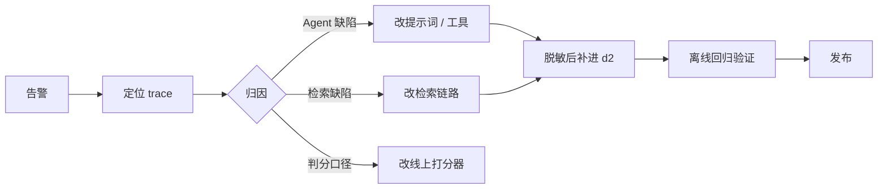

# 9 · 线上监控

前八篇的评估都在离线跑：固定用例、固定期望值、跑完出报告。本篇把评估搬到线上流量上——线上算哪些指标、trace 要怎么报才能被评估器读到、评估器与看板怎么配、告警触发后怎么回流。三层评估的分工见 [2 · 设计 · 6.2](https://tiltwind.github.io/refund-agent/doc/get-start/2-design.md#六持续评估闭环)。

本篇不新增仓库文件，产出是 Langfuse 项目里的四类对象，加上主链路埋点的一处改造：

| 产出 | 在哪 | 作用 |
|---|---|---|
| trace 上报改造 | [`services/telemetry.py`](https://github.com/tiltwind/refund-agent/blob/main/services/telemetry.py) + 线上入口 | 把评估器要读的字段报上去 |
| 自洽分数 | 链路内 `score_trace` | 三个免标注指标，全量 |
| 评估器 | Langfuse → Evaluation → Evaluators | 正确性、忠实度，采样 |
| 看板 | Langfuse → Dashboards | 报表 |
| 告警 | Langfuse → Monitors | 阈值触发通知 |

---

## 一、线上和离线的差别

| | 离线回归 | 线上监控 |
|---|---|---|
| 输入 | `cases.jsonl` 的 27 条 | 真实流量 |
| 真值 | `expected_output`（人工标注） | trace 内自洽 + 规则引擎返回 + 判官 |
| 指标数 | 十个打分器 | 三个确定性 + 两个判官 + 工程指标 |
| 成本 | 一轮几分钟的模型调用 | 判官调用费，按采样率摊 |
| 出口 | pass / fail 门禁 | 趋势 + 阈值告警 |

线上没有 `expected_output`，[7 · 7.4](https://tiltwind.github.io/refund-agent/doc/get-start/7-agent-dataset.md#74-从轮到用例从用例到-run) 列的十个打分器里只有三个能直接搬过来。其余分成两类：`decision_match` 这类结论层的判断交给判官近似；`tool_sequence`、`citation_hit` 这类依赖标注的留在离线。

## 二、线上指标盘

| 组 | 指标 | 真值来源 | 谁算 | 覆盖 | 用途 |
|---|---|---|---|---|---|
| **A 自洽** | `rule_consistency` | trace 内 `check_refund_eligibility` 的返回 | 链路内 | 全量 | 红线告警 |
| | `receipt_in_answer` | 答复单号 vs 本轮落库单号 | 链路内 | 全量 | 红线告警 |
| | `log_structure` | 一次终局动作恰好一行流水 | 链路内 | 全量 | 红线告警 |
| **B 判官** | `correctness` | 规则引擎判定（写进 trace） | Langfuse 评估器 | 采样 | 趋势 |
| | `faithfulness` | 本轮检索到的证据 | Langfuse 评估器 | 采样 | 趋势 |
| **C 工程** | 延迟 P50 / P90、token、成本 | trace 自带 | Langfuse | 全量 | 容量与成本 |
| | `error_rate` | span level = ERROR | Langfuse | 全量 | 故障 |
| | `outcome` 分布 | 链路内打的分类分数 | 链路内 | 全量 | 自动闭环率 |

A 组是确定性计算，不调模型，因此全量跑。B 组每条 trace 要多花一次模型调用，按采样率控制。

`outcome` 记成分类分数（`approved` / `denied` / `clarify` / `ask_order_id` / `handoff`）后，[0 · 需求](https://tiltwind.github.io/refund-agent/doc/get-start/0-requirement.md)第五节那条「自动闭环率 ≥ 70%」在线上能直接算出来——它在离线算不出，因为 `outcome` 枚举里没有 `handoff`（[7 · 五](https://tiltwind.github.io/refund-agent/doc/get-start/7-agent-dataset.md#五指标的收敛记录)）。线上把转人工单独记一档即可。

---

## 三、trace 怎么报

### 3.1 现在报了什么

`telemetry.trace_config()` 挂上 `CallbackHandler`，LangGraph 的图节点、工具调用和 LLM 调用自动转成 span，检索链路的五个 span 由 `telemetry.span()` 补齐。trace 层带 `session_id`、哈希后的 `user_id`、三个 tag 和一组 metadata。

排障用这些够了，在线评估还差三样：

| 缺什么 | 表现 |
|---|---|
| trace 级的干净 input / output | 评估器的 `{{input}}` 拿到的是完整 messages 列表，含系统提示 |
| 判官要的 context 与真值锚 | `{{context}}`、`{{ground_truth}}` 无处映射 |
| 线上与离线 trace 的隔离 | 跑批 trace 和生产流量混在同一批指标里 |

### 3.2 要补的四件事

**① 用 root span 兜住整轮。** `CallbackHandler` 生成的根节点是 LangGraph 的图，input / output 跟着图走。在 invoke 外面自己开一个 span 当 trace 根，input / output 由业务代码决定写什么。

**② trace_id 由 `request_id` 派生。** `create_trace_id(seed=request_id)` 是确定映射，客诉工单里只有 `request_id` 时可以直接算出 trace 地址，事后补分数也不用先查一遍。

**③ 判官要的字段写进 trace output。** `propagate_attributes` 的 metadata 值会被转成字符串并截到 200 字符，装不下检索证据。证据、答复、规则引擎判定三样合成一个对象，用 `set_trace_io` 写进 trace output，评估器映射到它的字段。

**④ 环境隔离。** `LANGFUSE_TRACING_ENVIRONMENT` 是 Langfuse 的一等字段，看板、评估器筛选、Monitors 都能按它切。线上进程设 `production`，跑批脚本设 `eval`。

```bash
# 线上
LANGFUSE_TRACING_ENVIRONMENT=production
# evals/experiments/*/run_experiment.py 与 rag/experiments/*
LANGFUSE_TRACING_ENVIRONMENT=eval
```

### 3.3 改造后的调用形状

```python
from langfuse import get_client, propagate_attributes

def handle(ctx: RefundContext, message: str, history: list) -> str:
    client = get_client()
    meta = registry.meta(version)

    with client.start_as_current_observation(
        name="refund-chat",
        as_type="agent",
        trace_context={"trace_id": client.create_trace_id(seed=ctx.request_id)},  # ②
        input=message,
    ) as root, propagate_attributes(                                              # ①
        user_id=telemetry.hash_customer(ctx.customer_id),
        session_id=ctx.session_id or ctx.request_id,
        tags=[f"agent:{meta['agent_version']}", f"prompt:{meta['prompt_version']}"],
        metadata={"request_id": ctx.request_id, "actor": ctx.actor},              # 短维度才放这
    ):
        log_before = len(store.decision_log())
        result = agent.invoke(
            {"messages": history + [{"role": "user", "content": message}]},
            context=ctx,
            config=telemetry.trace_config(ctx, meta),   # callback 照旧挂，span 挂进这条 trace
        )
        turn = observe(result["messages"], store.decision_log()[log_before:])

        root.set_trace_io(input=message, output={                                 # ③
            "answer": turn["answer"],
            "evidence": "\n\n".join(turn["tool_results"].get("search_refund_policy", [])),
            "rule_verdict": last_verdict(turn) or "",
        })
        for name, value, comment in online_scores(turn):
            root.score_trace(name=name, value=value, comment=comment)
        root.score_trace(name="outcome", value=actual_outcome(turn), data_type="CATEGORICAL")

    return turn["answer"]
```

`observe()` / `last_verdict()` / `actual_outcome()` 与 [`run_experiment.py`](https://github.com/tiltwind/refund-agent/blob/main/evals/experiments/ex-1/run_experiment.py) 里的同名函数是同一套逻辑：从本轮新增的 messages 和流水差集里提取 `tools` / `tool_results` / `answer` / `new_log` 四个字段（[7 · 7.1](https://tiltwind.github.io/refund-agent/doc/get-start/7-agent-dataset.md#71-判分的四个输入)）。线上少了 `expected`，能算的只剩不依赖它的那几个。

### 3.4 脱敏边界

`Langfuse(mask=...)` 是 SDK 级钩子，trace 的 input / output 和全部 span 属性都要过一遍（[`services/telemetry.py`](https://github.com/tiltwind/refund-agent/blob/main/services/telemetry.py)）。评估器读的是入库后的数据，因此判官的 prompt 里拿到的已经是脱敏文本。手机号、身份证、银行卡、邮箱走正则兜底，姓名和收货地址在写入 span 属性之前就不带进来。

---

## 四、自洽指标：在链路内算

三个指标的线上口径与离线的差别：

| 指标 | 离线口径 | 线上口径 |
|---|---|---|
| `rule_consistency` | 倒序取 `check_refund_eligibility` 的判定，映射成 outcome 后与实际结论比 | 完全相同，本来就不用标注 |
| `receipt_in_answer` | 按 `must_include_receipt_no` 双向判 | 改为自洽：有落库行则答复必须含 `new_log[-1]["receipt_no"]`；无落库行则答复不得出现 `\b[RD]\d{4,}\b` |
| `log_structure` | `log_match` 比对 `decision` / `order_id` / `amount` | 只留结构部分：调用了终局工具则新增流水恰好一行，未调用则零行 |

判分说明写进 `comment`：挂掉时要能从分数直接跳到「模型说了什么、实际落了什么」，不用再翻 span。

这三个不交给判官，原因是它们本身是确定性计算：读 trace 里的字符串做比对就能出结果，判官只会引入抖动和费用。判官负责的是自然语言层面——答复是否把规则引擎的结论如实转达、依据是否出自检索证据。

---

## 五、评估器：正确性与忠实度

### 5.1 配 LLM 连接

Langfuse UI → **Settings → LLM Connections**，填一组用于判官的模型凭据。判官模型与被测模型分开配，避免同一个模型既做答又判分。

### 5.2 正确性

Evaluation → **Evaluators → + Set up Evaluator**，选托管模板 **Correctness**，变量映射：

| 模板变量 | 映射到 | 内容 |
|---|---|---|
| `{{input}}` | Trace → input | 用户消息 |
| `{{output}}` | Trace → output 的 `answer` | 给用户的答复 |
| `{{ground_truth}}` | Trace → output 的 `rule_verdict` | 规则引擎的判定与理由 |

线上没有人工标注，真值锚取规则引擎的返回（[2 · 6.2](https://tiltwind.github.io/refund-agent/doc/get-start/2-design.md#六持续评估闭环)）。这一条判的是**答复层**：模型有没有把规则引擎给的结论原样转达给用户。落库层由 `rule_consistency` 判，两者分开读：

| `rule_consistency` | `correctness` | 读法 |
|---|---|---|
| 1 | 高 | 说的和做的都跟着规则引擎 |
| 1 | 低 | 落库对，但答复把结论说拧了或说漏了 |
| 0 | — | 模型推翻了规则引擎，先看这个 |

### 5.3 忠实度

同样从托管模板选 **Faithfulness**：

| 模板变量 | 映射到 | 内容 |
|---|---|---|
| `{{input}}` | Trace → input | 用户消息 |
| `{{output}}` | Trace → output 的 `answer` | 给用户的答复 |
| `{{context}}` | Trace → output 的 `evidence` | 本轮 `search_refund_policy` 的全部返回 |

判的是答复里的政策依据是否出自这批证据。它盯的是编造条款和编造数字——答复写「按平台规则金牌会员 20 天内可退」，而证据里写的是 15 天。

`citation_hit` 在离线只检查期望条款有没有被召回，不看答复怎么用这批证据（[7 · 五](https://tiltwind.github.io/refund-agent/doc/get-start/7-agent-dataset.md#五指标的收敛记录)）。忠实度补的是后半段。

### 5.4 范围、过滤与采样

每个评估器都要设三样：

| 项 | 取值 | 理由 |
|---|---|---|
| 目标 | traces | 变量都映射在 trace 层 |
| 过滤 | `environment = production` | 排掉跑批 trace，省钱且不污染看板 |
| 过滤 | `outcome ∈ {approved, denied}` | 追问轮没有终局结论，判正确性没有意义 |
| 采样 | correctness 20%，faithfulness 10% | 趋势用，不做逐条审计 |

异常段单独配一个评估器：过滤条件设为 `rule_consistency = 0` 或 `outcome = handoff`，采样率 100%。这批 trace 数量少，全量判官的费用可控，而它们正是要逐条看的那些。

### 5.5 判官分数怎么读

判官分数进看板和告警，不做发布门禁。理由与离线一致：门禁只用可重复计算的确定性指标（[7 · 一](https://tiltwind.github.io/refund-agent/doc/get-start/7-agent-dataset.md#一评估目标)）。判官分数掉了，出口是拉出低分 trace 人工看，判完再决定改 Agent、改检索还是改判官提示。

---

## 六、看板

Langfuse → **Dashboards → New Dashboard**，命名 `RefundAgent 线上质量`，加下面几个 widget。每个都带 `environment = production` 过滤。

| # | Widget | 数据源 | 指标 | 维度 | 图表 |
|---|---|---|---|---|---|
| 1 | 红线三指标趋势 | Scores (numeric) | avg，筛 `rule_consistency` / `receipt_in_answer` / `log_structure` | 时间（天） | 折线 |
| 2 | 判官分趋势 | Scores (numeric) | avg，筛 `correctness` / `faithfulness` | 时间（天） | 折线 |
| 3 | 判官分分布 | Scores (numeric) | count | 分数区间 | 直方 |
| 4 | 版本对比 | Scores (numeric) | avg | `agent_version` | 柱状 |
| 5 | outcome 分布 | Scores (categorical) | count，筛 `outcome` | 分类值 | 堆叠柱 |
| 6 | 延迟 | Traces | P50 / P90 latency | 时间 | 折线 |
| 7 | 开销 | Traces | token / cost | 时间、model | 折线 |
| 8 | 错误 | Traces | count，level = ERROR | 时间 | 折线 |

widget 4 是灰度的读数出口：`registry.select(rollout={"v1": 0.9, "v2": 0.1})` 放量后，同一块看板上按 `agent_version` 切开就是线上的版本对比（[2 · 6.4](https://tiltwind.github.io/refund-agent/doc/get-start/2-design.md#六持续评估闭环)）。tag 已经带了 `agent:v1` / `prompt:v1`，维度直接可用。

widget 5 的自动闭环率 = `approved` 与 `denied` 之和占全部 outcome 的比例。

---

## 七、告警

Langfuse → **Monitors → New Monitor**。每个监控项四要素：数据源、聚合、窗口、阈值。

| 监控项 | 数据源 | 聚合 | 窗口 | 阈值 | 触发后 |
|---|---|---|---|---|---|
| `rule_consistency` | Scores (numeric) | avg | 1h | `< 1.0` | 逐条查，模型推翻规则引擎属红线 |
| `receipt_in_answer` | Scores (numeric) | avg | 1h | `< 1.0` | 查「说了」与「做了」哪边错 |
| `log_structure` | Scores (numeric) | avg | 1h | `< 1.0` | 查重复落库与漏落库 |
| `correctness` | Scores (numeric) | avg | 24h | `< 0.90` | 拉低分 trace 人工判 |
| `faithfulness` | Scores (numeric) | avg | 24h | `< 0.85` | 看是检索没给证据还是模型没用证据 |
| 错误率 | Traces | count(level = ERROR) / count | 1h | `> 0.02` | 多半是 Milvus 或模型侧 |
| 延迟 | Traces | P90 latency | 1h | `> 90s` | 看是否模型限速 |

前三项是红线，阈值取 1.0：任何一次不自洽都要看。后面几项是趋势项，窗口拉到 24h 压掉抖动。

阈值的初值从离线基线来，跑满一周线上数据后按分位数重定：

| 来源 | 数字 |
|---|---|
| ex-1 单条延迟 P90 | 69.7s（并发 4，[8 · 3.3](https://tiltwind.github.io/refund-agent/doc/get-start/8-agent-eval.md#33-ex-1-的结论)） |
| ex-1 error_rate | 3.7%（27 条挂 1 条，检索零证据） |
| rag-ex-1 empty_context | 5.2%（96 条样本，[5 · 检索评测](https://tiltwind.github.io/refund-agent/doc/get-start/5-rag-eval.md)） |

错误率阈值取 2%，低于 ex-1 的 3.7%：那 3.7% 全部来自检索零证据后抛异常打断整轮，这条处置路径改成降级返回后不再计入错误（[8 · 六](https://tiltwind.github.io/refund-agent/doc/get-start/8-agent-eval.md#六后续规划)第 1 项）。

通知渠道在 Monitor 里选 Slack 或 Webhook。红线三项接值班渠道，趋势项接日报渠道。

---

## 八、告警之后



定位：告警带的是分数名与窗口，从看板下钻到低分 trace 列表；工单侧只有 `request_id` 时用 `create_trace_id(seed=request_id)` 算出 trace 地址。

回流的三条约束（[2 · 6.5](https://tiltwind.github.io/refund-agent/doc/get-start/2-design.md#六持续评估闭环)）：

| 约束 | 做法 |
|---|---|
| 保留原始表述 | 用户原话不改写成标准问法，脏数据和口语化正是线上补给离线的部分 |
| 脱敏后再进仓库 | trace 上报时已过 mask，落到 `cases.jsonl` 前再核一遍 |
| 期望值走自检 | 新用例先跑 `python evals/validate_cases.py`，与规则引擎对不上的直接拦下 |

线上回流的用例进 `d2`，不改 `d1`：改了 `d1` 的期望值，ex-1 的历史分数就不再可比（[8 · 二](https://tiltwind.github.io/refund-agent/doc/get-start/8-agent-eval.md#二sdk-实验脚本)）。

---

## 九、上线清单

| # | 做什么 | 验收 |
|---|---|---|
| 1 | 跑批脚本与线上进程分设 `LANGFUSE_TRACING_ENVIRONMENT` | Langfuse 上按 environment 能筛出两批互不相交的 trace |
| 2 | 线上入口包 root span，写 trace input / output | 任取一条 trace，input 是用户消息，output 有 `answer` / `evidence` / `rule_verdict` 三个字段 |
| 3 | 链路内打三个自洽分数 + `outcome` | 每条生产 trace 上有四个分数 |
| 4 | 配 correctness / faithfulness 评估器 | 按采样率出分，且只作用于 `environment = production` |
| 5 | 建看板 | 八个 widget 有数 |
| 6 | 建 Monitors 并接通知渠道 | 手工把阈值调到必触发，收到一次通知后调回 |
| 7 | 跑满一周后按分位数重定阈值 | 阈值来自线上分布，不再是离线基线 |

先做 1–3：自洽分数不花模型钱，全量覆盖，红线告警靠它。判官和看板排在后面。

---

## 参考

- [Custom Dashboards](https://langfuse.com/docs/metrics/features/custom-dashboards)
- [Monitors and Alerts](https://langfuse.com/docs/metrics/features/monitors)
- [LLM-as-a-Judge](https://langfuse.com/docs/evaluation/evaluation-methods/llm-as-a-judge)
