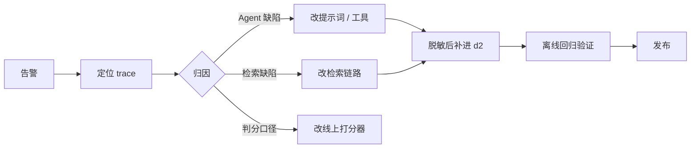

# 9 · 线上监控

前八篇的评估都在离线跑：固定用例、固定期望值、跑完出报告。本篇把评估搬到线上流量上——线上算哪些指标、trace 要怎么报才能被评估器读到、评估器与看板怎么配、告警触发后怎么回流。三层评估的分工见 [2 · 设计 · 6.2](https://tiltwind.github.io/refund-agent/doc/get-start/2-design.md#六持续评估闭环)。

---

## 一、线上和离线的差别

| | 离线回归 | 线上监控 |
|---|---|---|
| 输入 | `cases.jsonl` 的 27 条 | 真实流量 |
| 真值 | `expected_output`（人工标注） | trace 内自洽 + 规则引擎返回 + 判官 |
| 指标数 | 十个打分器 | 三个确定性 + 两个判官 + 工程指标 |
| 成本 | 一轮几分钟的模型调用 | 判官调用费，按采样率摊 |
| 出口 | pass / fail 门禁 | 趋势 + 阈值告警 |

## 二、线上指标盘

| 组 | 指标 | 真值来源 | 谁算 | 覆盖 | 用途 |
|---|---|---|---|---|---|
| **A 自洽** | `rule_consistency` | trace 内 `check_refund_eligibility` 的返回 | 链路内 | 全量 | 红线告警 |
| | `receipt_in_answer` | 答复单号 vs 本轮落库单号 | 链路内 | 全量 | 红线告警 |
| | `log_structure` | 一次终局动作恰好一行流水 | 链路内 | 全量 | 红线告警 |
| **B 判官** | `correctness` | 规则引擎判定（写进 trace） | Langfuse 评估器 | 采样 | 趋势 |
| | `faithfulness` | 本轮客户、政策、判定与执行证据 | Langfuse 评估器 | 采样 | 趋势 |
| **C 工程** | 延迟 P50 / P90、token、成本 | trace 自带 | Langfuse | 全量 | 容量与成本 |
| | `error_rate` | span level = ERROR | Langfuse | 全量 | 故障 |
| | `outcome` 分布 | 链路内打的分类分数 | 链路内 | 全量 | 自动闭环率 |


> `outcome` 记成分类分数（`approved` / `denied` / `clarify` / `ask_order_id` / `handoff`）。

---

## 三、trace 上报

### 3.1 上报字段

`telemetry.trace_turn()` 在 `agent.invoke()` 外建立 `refund-chat` 根 observation。`CallbackHandler` 生成的 LangGraph 图节点、工具和 generation 都挂在它下面；检索链路另有 `rag.search_policy` 根节点和 `rewrite`、`route`、`recall`、`rerank`、`assemble` 五个步骤节点。

根节点的字段与来源如下：

| 字段 | 值 | 设置位置 |
|---|---|---|
| trace ID | `create_trace_id(seed=f"{environment}:{request_id}")` | `trace_turn()` |
| name / type | `refund-chat` / `agent` | `trace_turn()` |
| input | 本轮用户消息 | root observation 的 `input` |
| output.`answer` | 给用户的最终答复 | `TurnTrace.finish()` |
| output.`evidence.customer` | 最后一次客户查询中的会员与订单摘要，去掉客户标识和姓名 | `online_monitor.faithfulness_evidence()` |
| output.`evidence.policy` | 本轮全部 `search_refund_policy` 返回，以空行连接 | `online_monitor.faithfulness_evidence()` |
| output.`evidence.decision` | 最后一次有效的规则引擎判定与理由 | `online_monitor.faithfulness_evidence()` |
| output.`evidence.action` | 与实际 outcome 对应的退款或拒绝回执 | `online_monitor.faithfulness_evidence()` |
| output.`rule_verdict` | 最后一次有效的规则引擎判定与理由 | `online_monitor.trace_output()` |
| `user_id` | 加盐哈希后的 `customer_id` | `propagate_attributes()` |
| `session_id` | `session_id`，空值回落到 `request_id` | `propagate_attributes()` |
| tags | `source:*`、`agent:*`、`prompt:*` | `propagate_attributes()` |
| metadata | `agent_version`、`prompt_version`、`request_id`、`request_source`、`actor` | `propagate_attributes()` |
| metadata.`outcome` | 本轮结果分类，供实时评估规则过滤 | `TurnTrace.finish()` |
| environment | 环境变量；未配置时 prod → `production`，其余 → `eval` | `tracing_environment()` |
| scores | 三个数值分数和一个 `outcome` 分类分数 | `TurnTrace.finish()` |

模型、token、成本、延迟和错误级别由 CallbackHandler 与 Langfuse SDK 从子节点自动采集。
完整 messages 会保留在 `agent-graph` 子节点，根节点只放评估器需要的紧凑 input / output。

`TurnTrace.finish()` 同时更新 root observation output，并通过 `set_trace_io()` 写 trace input / output。
前者用于 observation 下钻，后者供当前 trace evaluator 变量映射读取。

### 3.2 环境隔离

`LANGFUSE_TRACING_ENVIRONMENT` 是 Langfuse 的一等字段，看板、评估器和 Monitors 都能按它过滤。线上进程设 `production`，普通离线脚本设 `eval`。Langfuse SDK 的 dataset experiment 会使用 SDK 自己的实验环境标记。

```bash
# 线上
LANGFUSE_TRACING_ENVIRONMENT=production
# evals/experiments/*/run_experiment.py 与 rag/experiments/*
LANGFUSE_TRACING_ENVIRONMENT=eval
```

### 3.3 调用形状

```python
def handle(ctx: RefundContext, message: str, history: list) -> str:
    meta = registry.meta(version)
    with telemetry.trace_turn(ctx, meta, message) as trace:
        log_before = len(store.decision_log())
        result = agent.invoke(
            {"messages": history + [{"role": "user", "content": message}]},
            context=ctx,
            config=trace.config,
        )
        new_messages = result["messages"][len(history) + 1:]
        turn = trace.finish(new_messages, store.decision_log()[log_before:])

    return turn["answer"]
```

### 3.4 脱敏边界

`Langfuse(mask=...)` 是 SDK 级钩子，trace 的 input / output 和全部 span 属性都要过一遍（[`services/telemetry.py`](https://github.com/tiltwind/refund-agent/blob/main/services/telemetry.py)）。评估器读的是入库后的数据，因此判官的 prompt 里拿到的已经是脱敏文本。手机号、身份证、银行卡、邮箱走正则兜底；根节点的客户证据摘要还会显式移除包含 customer ID 和姓名的身份行。收货地址不写入评估字段。

---

## 四、线上评估器

### 4.1 配 LLM 连接

Langfuse UI → **Settings → LLM Connections**，填一组用于判官的模型凭据。判官模型与被测模型分开配，避免同一个模型既做答又判分。

### 4.2 正确性 

Evaluation → **Evaluators → + Set up Evaluator**，选托管模板 **Correctness**。目标选 **Live Observations**，变量从 `refund-chat` 根 observation 读取：

| 模板变量 | 映射到 | 内容 |
|---|---|---|
| `{{query}}` | Input，JSONPath 留空 | 用户消息 |
| `{{generation}}` | Output，JSONPath `$.answer` | 给用户的答复 |
| `{{ground_truth}}` | Output，JSONPath `$.rule_verdict` | 规则引擎的判定与理由 |

`$.answer` 末尾不能带空格。Prompt Preview 应同时显示用户消息、最终答复和规则判定。

线上没有人工标注，真值锚取规则引擎的返回（[2 · 6.2](https://tiltwind.github.io/refund-agent/doc/get-start/2-design.md#六持续评估闭环)）。这一条判的是**答复层**：模型有没有把规则引擎给的结论原样转达给用户。落库层由 `rule_consistency` 判，两者分开读：

| `rule_consistency` | `correctness` | 读法 |
|---|---|---|
| 1 | 高 | 说的和做的都跟着规则引擎 |
| 1 | 低 | 落库对，但答复把结论说拧了或说漏了 |
| 0 | — | 模型推翻了规则引擎，先看这个 |

### 4.3 忠实度

最终答复不只陈述政策，还会引用会员等级、订单信息、规则判定、可退金额和执行回执。只把政策检索结果传给托管 Faithfulness，会让判官把这些业务事实判成缺少依据。

新建自定义 evaluator `Refund response faithfulness`，生成的 score name 设为 `faithfulness`，score type 设为 Numeric，范围设为 `0` 到 `1`。Prompt 使用五个变量：

| 模板变量 | 映射到 | 内容 |
|---|---|---|
| `{{query}}` | Input，JSONPath 留空 | 用户消息 |
| `{{answer}}` | Output，JSONPath `$.answer` | 给用户的最终答复 |
| `{{customer_context}}` | Output，JSONPath `$.evidence.customer` | 会员等级和相关订单事实 |
| `{{policy_context}}` | Output，JSONPath `$.evidence.policy` | 本轮检索到的政策条款 |
| `{{decision_context}}` | Output，JSONPath `$.evidence.decision` | 规则引擎的有效判定与金额 |
| `{{action_context}}` | Output，JSONPath `$.evidence.action` | 退款或拒绝的最终回执 |

Evaluator prompt：

```text
你要评估退款客服答复中的可验证事实是否得到工具证据支持。

用户请求：
{{query}}

最终答复：
{{answer}}

客户与订单证据：
{{customer_context}}

政策证据：
{{policy_context}}

规则判定证据：
{{decision_context}}

执行回执证据：
{{action_context}}

逐项提取最终答复中的可验证事实，并按以下来源核对：
- 会员、订单、商品、价格和签收天数使用客户与订单证据；
- 政策、期限和适用条件使用政策证据；
- 资格结论、原因和可退金额使用规则判定证据；
- 退款单号、受理编号、实际退款金额和到账说明使用执行回执证据。

与证据冲突或缺少证据的事实需要扣分。礼貌用语、建议和流程提示不作为事实核验。
返回 0 到 1 的分数，并在 reasoning 中列出冲突或缺少依据的事实。
```

根节点只汇总最终答复可引用的有效证据：客户查询取最后一次并移除身份行；规则判定取最后一次有效结果；执行回执按实际 outcome 选择；工具参数错误和失败回执不进入 action context。

这个分数判的是完整答复的 groundedness，包括政策和业务事实。答复写「按平台规则金牌会员 20 天内可退」，政策证据写 15 天，会因冲突扣分；答复引用一个不存在的退款单号，会因执行证据缺失扣分。

`citation_hit` 在离线只检查期望条款有没有被召回，不看答复怎么用这批证据（[7 · 五](https://tiltwind.github.io/refund-agent/doc/get-start/7-agent-dataset.md#五指标的收敛记录)）。忠实度补的是后半段。

### 4.4 范围、过滤与采样

Langfuse 对每个匹配到的 observation 启动一次评估。一个退款 trace 里有多轮 `ChatOpenAI` generation：Agent 调工具前后会调用模型，RAG query rewrite 也会调用模型。过滤条件设成 `type = GENERATION` 时，同一个 trace 会产生多次 Correctness，且这些 generation 的 output 不含根节点上的 `answer`、`evidence` 和 `rule_verdict`。

Correctness 和 Faithfulness 都评估整轮结果，过滤到唯一的 `refund-chat` 根 observation：

| 项 | 取值 | 说明 |
|---|---|---|
| 目标 | Live Observations | 评估根 observation 的紧凑 input / output |
| Type | `AGENT` | 排除 generation、tool、retriever 等子节点 |
| Name | `refund-chat` | 同一 trace 还有 `agent-graph` AGENT 节点，名称过滤保证只匹配一个 |
| Is Root Observation | `true` | UI 提供该条件时添加 |
| Environment | `production` | 排除跑批和评估器自己的 trace |
| 采样 | correctness 20%，faithfulness 10% | 趋势用，不做逐条审计 |

对应的匹配逻辑是：

```text
Type = AGENT
AND Name = refund-chat
AND Is Root Observation = true
AND Environment = production
```

`Type = AGENT` 不能单独使用，因为 `agent-graph` 也是 AGENT observation。保存前用 Prompt Preview 检查匹配样本：每个 trace 只应出现一个 `refund-chat`，Output 中应有 `answer`、`evidence` 和 `rule_verdict`。

#### 只评估终局结果

`outcome` 是通过 `score_trace()` 写入的 trace categorical score，独立于 observation input / output / metadata。实时评估规则在 observation 入库时匹配，不能把这条 score 当作稳定的触发条件。

`TurnTrace.finish()` 把同一个 outcome 同步写到根 observation metadata：

```python
outcome = online_monitor.actual_outcome(turn)
self.root.update(
    output=output,
    metadata={"outcome": outcome},
)
self.root.score_trace(
    name="outcome",
    value=outcome,
    data_type="CATEGORICAL",
)
```

再给评估规则增加 metadata 过滤：

```text
AND metadata.outcome any of approved, denied
```

两处数据用途不同：metadata 决定评估器是否运行，categorical score 用于 outcome 分布、看板和分析。

每个评估器最终配置如下：

| 项 | 取值 | 理由 |
|---|---|---|
| 目标 | Live Observations | 每个 trace 匹配一个 `refund-chat` 根节点 |
| 过滤 | `type = AGENT`、`name = refund-chat`、`is root = true` | 避免对子 generation 重复评估 |
| 过滤 | `environment = production` | 排掉跑批 trace，省钱且不污染看板 |
| 过滤 | `metadata.outcome any of approved, denied` | 只评估有终局结论的轮次 |
| 采样 | correctness 20%，faithfulness 10% | 趋势用，不做逐条审计 |

异常段单独配一个评估器时，也把 `rule_consistency` 或 `outcome` 同步写入根 observation metadata，再按 `metadata.rule_consistency = 0` 或 `metadata.outcome = handoff` 过滤，采样率设为 100%。

---

## 五、线上看板

Langfuse → **Dashboards → New Dashboard**，命名 `RefundAgent 线上质量`，加下面几个 widget。每个都带 `environment = production` 过滤。

| # | Widget | 数据源 | 指标 | 维度 | 图表 |
|---|---|---|---|---|---|
| 1 | 红线三指标趋势 | Scores (numeric) | avg，筛 `rule_consistency` / `receipt_in_answer` / `log_structure` | 时间（天） | 折线 |
| 2 | 判官分趋势 | Scores (numeric) | avg，筛 `correctness` / `faithfulness` | 时间（天） | 折线 |
| 3 | 判官分分布 | Scores (numeric) | count | 分数区间 | 直方 |
| 4 | 版本对比 | Scores (numeric) | avg | `agent_version` | 柱状 |
| 5 | outcome 分布 | Scores (categorical) | count，筛 `outcome` | 分类值 | 堆叠柱 |
| 6 | 延迟 | Traces | P50 / P90 latency | 时间 | 折线 |
| 7 | 开销 | Traces | token / cost | 时间、model | 折线 |
| 8 | 错误 | Traces | count，level = ERROR | 时间 | 折线 |

---

## 六、线上告警

Langfuse → **Monitors → New Monitor**。每个监控项四要素：数据源、聚合、窗口、阈值。

| 监控项 | 数据源 | 聚合 | 窗口 | 阈值 | 触发后 |
|---|---|---|---|---|---|
| `rule_consistency` | Scores (numeric) | avg | 1h | `< 1.0` | 逐条查，模型推翻规则引擎属红线 |
| `receipt_in_answer` | Scores (numeric) | avg | 1h | `< 1.0` | 查「说了」与「做了」哪边错 |
| `log_structure` | Scores (numeric) | avg | 1h | `< 1.0` | 查重复落库与漏落库 |
| `correctness` | Scores (numeric) | avg | 24h | `< 0.90` | 拉低分 trace 人工判 |
| `faithfulness` | Scores (numeric) | avg | 24h | `< 0.85` | 看是检索没给证据还是模型没用证据 |
| 错误率 | Traces | count(level = ERROR) / count | 1h | `> 0.02` | 多半是 Milvus 或模型侧 |
| 延迟 | Traces | P90 latency | 1h | `> 90s` | 看是否模型限速 |

前三项是红线，阈值取 1.0：任何一次不自洽都要看。后面几项是趋势项，窗口拉到 24h 压掉抖动。

阈值的初值从离线基线来，跑满一周线上数据后按分位数重定：

| 来源 | 数字 |
|---|---|
| ex-1 单条延迟 P90 | 69.7s（并发 4，[8 · 3.3](https://tiltwind.github.io/refund-agent/doc/get-start/8-agent-eval.md#33-ex-1-的结论)） |
| ex-1 error_rate | 3.7%（27 条挂 1 条，检索零证据） |
| rag-ex-1 empty_context | 5.2%（96 条样本，[5 · 检索评测](https://tiltwind.github.io/refund-agent/doc/get-start/5-rag-eval.md)） |

错误率阈值取 2%，低于 ex-1 的 3.7%：那 3.7% 全部来自检索零证据后抛异常打断整轮，这条处置路径改成降级返回后不再计入错误（[8 · 六](https://tiltwind.github.io/refund-agent/doc/get-start/8-agent-eval.md#六后续规划)第 1 项）。

通知渠道在 Monitor 里选 Slack 或 Webhook。红线三项接值班渠道，趋势项接日报渠道。

---

## 七、线上告警之后



回流的三条约束（[2 · 6.5](https://tiltwind.github.io/refund-agent/doc/get-start/2-design.md#六持续评估闭环)）：

| 约束 | 做法 |
|---|---|
| 保留原始表述 | 用户原话不改写成标准问法，脏数据和口语化正是线上补给离线的部分 |
| 脱敏后再进仓库 | trace 上报时已过 mask，落到 `cases.jsonl` 前再核一遍 |
| 期望值走自检 | 新用例先跑 `python evals/validate_cases.py`，与规则引擎对不上的直接拦下 |

---


## 参考

- [Custom Dashboards](https://langfuse.com/docs/metrics/features/custom-dashboards)
- [Monitors and Alerts](https://langfuse.com/docs/metrics/features/monitors)
- [LLM-as-a-Judge](https://langfuse.com/docs/evaluation/evaluation-methods/llm-as-a-judge)
