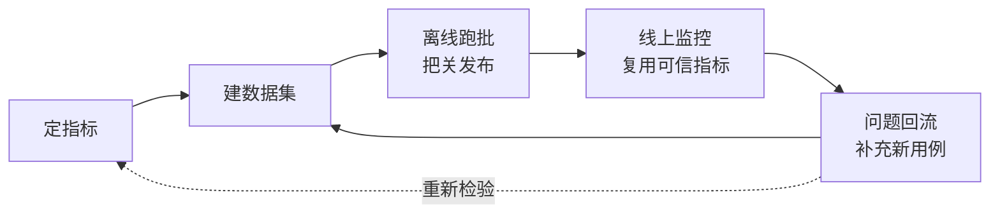

# Agent 评估核心步骤

搭一套 Agent 评估体系的思路：先定指标，再建数据集，离线跑批把关发布，线上监控复用可信的指标，问题回流成新用例。本篇讲思路，不绑定具体实现。

## 一、评估核心三个问题

| 问题 | 谁用 | 对指标的要求 |
|---|---|---|
| 改动能不能发布 | 发版的人 | 有明确的 pass / fail，能自动跑 |
| 新版本比旧版本好不好 | 迭代的人 | 口径稳定，同一批用例跑两遍结果一致 |
| 问题出在哪一步 | 改 Agent 的人 | 能下钻到具体用例、具体环节 |

## 二、从流程失效模式倒推指标

把 Agent 的处理流程拆成几个环节，每个环节问一句「这一步会怎么错」，倒推出对应指标：

| 环节 | 可能的失效 | 对应指标方向 |
|---|---|---|
| 理解与决策 | 结论本身错了 | 决策正确率 |
| 决策依据 | 结论不是来自可信来源，是模型自己编的 | 依据一致率 |
| 执行流程 | 该走的步骤漏了、顺序错了 | 流程合规率 |
| 终局动作 | 该执行的没真正执行，或执行了没留痕 | 执行落地率 |
| 安全边界 | 越权、泄露、被注入指令带偏、重复执行 | 安全红线 |
| 开销 | 重复调用、token 和延迟膨胀 | 经济性（观察项） |

前五类各自对应一个核心指标，第六类先记录不设门禁——没有历史基线，阈值定不出来。

## 三、核心指标与含义

| 指标 | 回答什么 | 判断依据 | 真值来源 | 类型 | 能否上线 |
|---|---|---|---|---|---|
| 决策正确率 | 结论对不对 | 与标注答案比对 | 人工标注 | 硬 · 门禁 | 否 |
| 依据一致率 | 结论是不是从可信判定源（规则、检索证据）来的，而不是模型越权替代 | 只看执行记录内部自洽 | 不需要标注 | 硬 · 门禁 | 是 |
| 流程合规率 | 必需步骤有没有走全、顺序对不对 | 与标注的期望调用序列比对 | 人工标注 | 硬 · 门禁 | 否 |
| 执行落地率 | 终局动作有没有真实发生并留痕，答复里的凭证是不是真的 | 执行记录与答复是否一致 | 结构性部分不需要标注 | 硬 · 门禁 | 结构性部分可 |
| 安全红线 | 越权、泄露、注入、重放 | 与禁止内容清单和幂等检查比对 | 人工标注 | 硬 · 门禁 | 幂等/权限检查可，对抗样本类不可 |
| 证据召回（对应「决策依据」环节） | 该用的依据有没有被找到 | 与期望依据比对 | 人工标注 | 软 · 观察 | 否，线上用忠实度判官近似 |
| 要素覆盖（对应「理解与决策」环节） | 答复该提到的信息有没有提到 | 与期望要素比对 | 人工标注 | 软 · 观察 | 否，线上用正确性判官近似 |
| 调用经济性 | 有没有多余的调用 | 调用次数与上限比对 | 人工标注 | 软 · 观察 | 是，有基线后可升门禁 |

两条分界线：

- **硬指标决定用例过不过，软指标只记分。** 检索排序这类天然有波动的维度不该拖累发布判断，混进门禁会让回归报告被无关抖动淹没。
- **能否只靠执行记录内部自洽判断，决定这个指标能不能搬到线上。** 依据一致率、执行落地率的结构性部分不需要人工标注真值，离线怎么判、线上就怎么判，是同一套逻辑；其余指标依赖标注答案，只能用在有标注的离线数据集里，线上没有真值可比对时靠判官模型对同一份决策证据做近似判断，只看趋势，不当发布门禁。

决策正确率和依据一致率看着接近，分工不同：前者对的是标注答案，后者对的是这次执行内部有没有自洽。两者同时不过，说明模型绕开了判定依据；前者不过、后者满分，说明判定依据本身给错了结果，问题不在 Agent。

安全红线内部也分两类：幂等、权限这类能写成规则自动核对，全量跑；越权、注入这类要靠专门构造的对抗样本人工判断，常规用例覆盖不到。

## 四、由指标反推数据集

数据集不是先攒案例再看能测什么，是每个核心指标先定好要什么样本，再去凑：

| 要求 | 原因 |
|---|---|
| 每个核心指标都要有对应的正负样本 | 只有正样本测不出误判 |
| 边界样本成对出现，条件只差一点但结论相反 | 边界正是最容易判错的地方 |
| 反样本同样重要：证明不该发生的事情确实没发生 | 只有正确执行的样本，测不出「不该做的时候会不会误做」 |
| 专门构造对抗样本：情绪施压、伪造身份、援引不存在的依据、指令注入 | 覆盖安全红线，不能指望常规样本顺带覆盖到 |
| 按优先级分层，红线样本单独统计通过率 | 混进大量体验类样本会稀释掉一次严重越权 |
| 每条用例的期望值至少包含期望结论、期望调用序列、禁止项、终局动作 | 分别对应决策正确率、流程合规率、安全红线、执行落地率的判断依据，缺一项就少验一个指标 |

## 五、离线跑批与出结论

1. 逐条执行用例，把这一轮的输入、工具调用、工具返回、最终答复、落地记录压缩成打分需要的结构化痕迹；
2. 每个指标是一个纯函数，只吃这份痕迹和期望值出分，硬指标不引入模型判分，保证可离线重复计算、结果稳定；
3. 单条判分先聚合成用例级结果（多轮场景取合取，一轮不过整条不过），再聚合成这次运行的汇总；能不能发布看这次汇总：硬指标用例级 100% 通过，红线样本单独统计的通过率同样要求 100%；
4. 和上一次运行对比，看结论有没有退化；对比固定同一批数据集和同一版本评分器，只换 Agent 或 prompt 版本，差异才归得清；退化定位到具体用例、具体指标，不只看总分；
5. 现有指标覆盖不到的内容质量问题（比如证据的措辞、结构是否合理），跑批之后抽查若干条完整执行记录补上。

执行失败（环境或调用异常）和判分失败是两回事，分开统计——环境故障读成 Agent 退化会误导后续改动方向。

## 六、trace 上报数据

评估器和看板不会自己去完整对话记录里翻找，trace 要显式准备好这几类内容：

| 类别 | 内容 | 作用 |
|---|---|---|
| 输入 | 触发这一轮的原始请求 | 评估器和人工核查的起点 |
| 输出 | 最终对外的答复 | 判「说了什么」 |
| 决策证据 | 支撑最终结论的关键中间产物：引用了什么依据、判定结果是什么、执行回执是什么 | 单独摘出来给判官用，不指望它从完整对话里自己找，也不该把无关的工具报错、重试细节一起塞进去 |
| 标识与分类 | 版本号、环境标记（线上 / 离线）、结果分类、脱敏后的用户与会话标识 | 供过滤、分组、下钻用 |
| 确定性分数 | 能在链路内直接算出的分数 | 随执行过程一起写回，不用等评估器事后补算 |

每类评估器只读自己对应的字段，不整段转发 messages，判官的输入才干净、成本才可控。

脱敏在写入存储之前统一处理一遍，不要指望下游各个环节各自去做——判官读到的、看板显示的都应该是脱敏之后的数据。

## 七、线上监控配置

### 7.1 判官隔离

线上没有标注可比对，只能靠两类真值撑门面：trace 内部的自洽判断（复用离线的依据一致率、执行落地率逻辑，全量算）和判官模型的近似判断（覆盖离线阶段验证过的软指标，抽样算）。判官用的模型凭据要和被测模型分开，同一个模型既回答又判自己的分，判分没有意义。

### 7.2 能自动算 vs 需要判官

能在链路内直接算出的指标随执行写分，不用配判官。需要「理解」内容的指标才配判官，且判官只覆盖离线阶段已经验证过的那几个软指标，不临时加新维度——新维度没有离线基线，线上告警了也判断不出是真退化还是判官本身没调好。评估目标只打向代表整轮结果的那个节点，避免同一次执行里的中间调用被重复评分；判官调用有成本，只做趋势判断的设采样率，不用全量跑。

### 7.3 看板维度

红线指标趋势、判官分趋势与分布、版本对比、结果分类分布、工程指标（延迟、token、成本、错误率）——这五类基本覆盖发布后要盯的东西。

### 7.4 告警分层

红线类（自洽性指标）用短窗口（如 1 小时），不留容忍度，一旦出现不自洽就要看；判官类用长窗口（如 24 小时）压掉抖动，只看趋势下滑；工程类（延迟、错误率）用离线基线做初值，跑满一段时间后按线上分位数重定。

### 7.5 告警之后

定位到具体执行记录，判断问题出在 Agent 本身、判定依据的质量，还是判分口径设错了；修复后把这条脱敏后的样本补进数据集，跑一遍离线回归确认不再复现，再发布。

## 八、整体闭环

定指标 → 建数据集 → 离线跑批把关发布 → 线上监控复用可信的指标 → 问题回流成新用例 → 反过来检验指标和数据集是否够用。这套循环不是走一遍就结束，每次线上发现新的失效模式，都要回到第二步重新过一遍「这一步会怎么错」。

指标和数据集不够用的信号：同一个判官指标连续误报多次、某类线上事故对应的失效模式在数据集里零覆盖、硬指标全过但人工抽查仍然发现问题。出现任一条，先改指标和数据集，再改 Agent。
